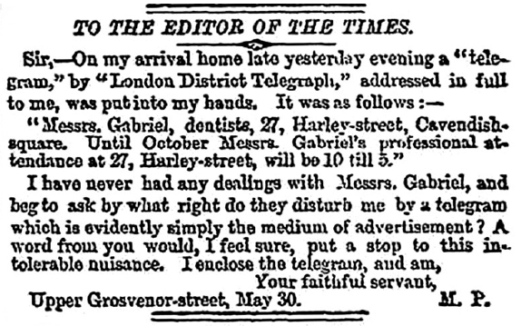
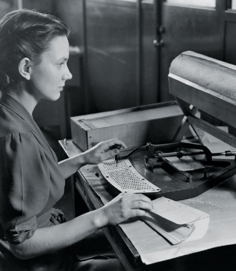
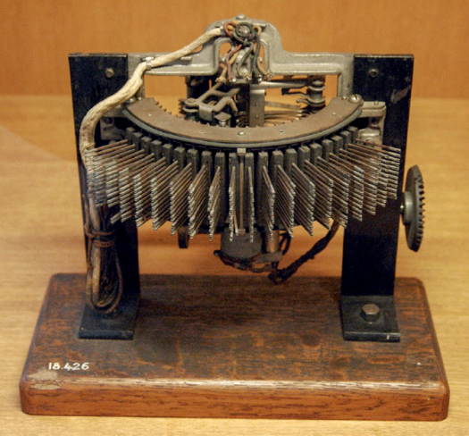
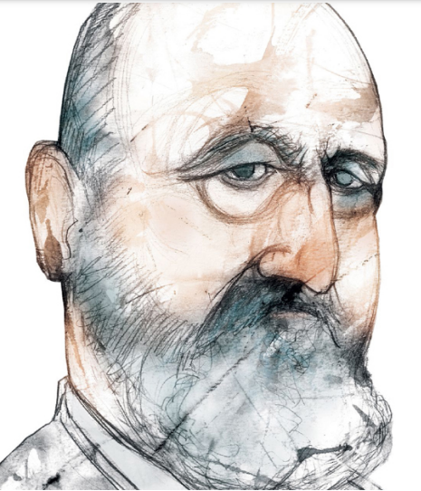
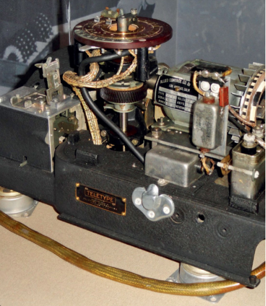
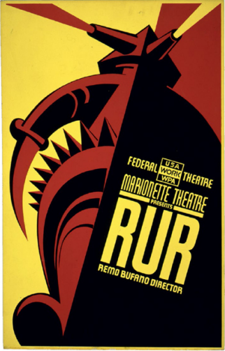
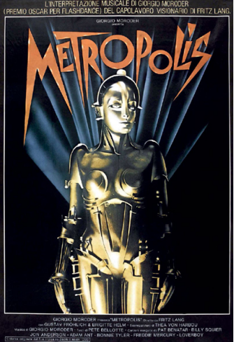

## 1864
### Pesan Spam Elektromagnetik Pertama
---
William Fothergill Cooke and Charles Wheatstone’s electromagnetic telegraph menggemparkan Inggris tak lama setelah layanan komersial dimulai pada tahun 1837. Pada tahun 1868, ada lebih dari 10.000 mil kabel telegraf di Inggris yang mendukung 1.300 stasiun telegraf; empat tahun kemudian, ada 5.179 stasiun, dilayani oleh lebih dari 87.000 mil kabel.

Dengan kemampuan untuk menjangkau sejumlah besar orang dengan cepat dan mudah, iklan elektrik pertama yang tidak diminta di dunia dikirim di London pada sore hari tanggal 29 Mei 1864, menurut sejarawan Matthew Sweet. Pesan itu dari Pak Gabriel, sekelompok dokter gigi yang tidak terdaftar, yang menjual berbagai macam gigi palsu, gusi, pasta gigi, dan bedak gigi.

##### _Pesan tersebut, yang dikirim ke anggota Parlemen saat ini dan sebelumnya, berbunyi sebagai berikut :_
##

_Tuan Gabriel, dokter gigi, jalan Harley, alun-alun Cavendish. Sampai Oktober kehadiran profesional Tuan Gabriel di 27, Harleystreet, akan 10 sampai 5._

Pada tahun 1864 tidak ada telegraf di tempat tinggal pribadi; pesan itu muncul di jarum ayun telegraf elektromagnetik Cooke-Wheatstone, di mana pesan itu ditranskripsikan oleh operator, dibawa oleh seorang anak laki-laki yang dikirim dari Perusahaan Telegraf Distrik London, dan diserahkan ke tangan seorang anggota Parlemen.

##### _Pada tanggal 29 Mei 1864, Tuan Gabriel, mengirimkan pesan elektronik paling awal yang tidak diminta kepada anggota Parlemen Inggris._

#
#
# 1890
## Tabulasi Sensus AS
#### **Herman Hollerith** (1860–1929)
---
Penemu Amerika Herman Hollerith telah bekerja sebentar di Biro Sensus sebelum sensus 1880 dan pada tahun 1882 bergabung dengan fakultas MIT, di mana dia mengajar teknik mesin dan bereksperimen dengan sistem tabulasi mekanik. Sistem awalnya menggunakan gulungan pita kertas yang panjang dengan data yang direpresentasikan sebagai lubang berlubang. Kemudian, dalam perjalanan kereta api ke Amerika Barat, Hollerith melihat bagaimana kondektur membuat lubang pada tiket kertas yang sesuai dengan warna rambut seseorang, warna mata, dan sebagainya, sehingga tiket tidak dapat digunakan kembali oleh penumpang lain. Hollerith segera mengganti sistemnya untuk menggunakan kartu kertas.

Hollerith memasuki kompetisi 1888 dan menang, sistemnya secara dramatis lebih cepat daripada dua peserta lainnya. Pada tanggal 8 Januari 1889, ia dianugerahi paten AS pada "metode, sistem dan peralatan untuk menyusun statistik," awalnya diajukan 23 September 1884.

Sistem Hollerith terdiri dari kartu yang sedikit melengkung berukuran 3,25 by 7,375 inci (83 milimeter kali 187 milimeter). Seorang operator manusia membuat lubang di kartu dengan alat yang disebut _Pantographic Card Punch_, dengan lubang di lokasi tertentu untuk menandakan jenis kelamin seseorang, status perkawinan, ras, kepemilikan dan hutang pertanian dan rumah, dan informasi lainnya. Untuk tabulasi, kartu dilewatkan melalui pembaca dengan saklar mikro untuk mendeteksi keberadaan lubang dan sirkuit elektromekanis untuk melakukan tabulasi yang sebenarnya.

##### _Foto ini dari sensus AS 1940._

#
#
# 1891
## Strowger Step-by-Step Switch
#### **Almon Brown Strowger** (1839–1902)
---
Almon Strowger adalah seorang pengurus di Kansas City, Missouri. Dia memperhatikan bahwa bisnisnya telah menurun karena telepon menjadi lebih populer. Strowger mengetahui bahwa salah satu operator telepon menikah dengan pesaingnya, dan setiap kali ada panggilan telepon untuk pengurus, dia akan mengarahkan panggilan ke suaminya. Termotivasi, Strowger menemukan saklar langkah demi langkah, perangkat elektromekanis yang akan menyelesaikan sirkuit antara satu telepon dan bank lain tergantung pada urutan pulsa listrik yang dikirim ke saluran telepon. Alih-alih mengandalkan operator untuk terhubung, Strowger membayangkan bahwa orang akan mengetuk kode menggunakan sepasang tombol tekan.

Strowger, anggota keluarga, dan investor kemudian menciptakan Strowger Automatic Telephone Exchange Company pada tahun 1891. Mereka pergi ke La Porte, Indiana, yang baru-baru ini kehilangan sistem teleponnya karena sengketa paten antara operator independen lokal dan Bell Telephone System, dan mengatur pertukaran telepon otomatis pertama di dunia dengan panggilan langsung— setidaknya untuk panggilan lokal—pada tahun 1892.

Saklar itu disebut _"step-by-step"_ karena cara panggilan telepon diselesaikan, satu digit keluar pada satu waktu. Pertukaran selangkah demi selangkah tetap beroperasi di seluruh Amerika Serikat hingga 1999, ketika yang terakhir dihapus dari layanan, digantikan oleh pertukaran lokal terkomputerisasi #5ESS.

##### _Penggerak gesekan Rotary Western Electric 7A, No. 7001 Line Finder._

#
#
# 1914
## Floating-Point Numbers
#### **Leonardo Torres y Quevedo** (1852–1936), **William Kahan** (b. 1933)
---
Leonardo Torres y Quevedo adalah seorang insinyur dan matematikawan Spanyol yang senang membuat mesin praktis. Pada tahun 1906, ia mendemonstrasikan model perahu yang dikendalikan radio untuk raja Spanyol, dan ia merancang kapal udara semirigid yang digunakan dalam Perang Dunia I.

##### _Potret Leonardo Torres y Quevedo oleh kartunis dan ilustrator Argentina Eulogia Merle (lahir 1976)._

#
#
# 1917
## Vernam Cipher
#### **Gilbert Vernam** (1890-1960), **Joseph Mauborgne**(1881–1971)

Lebih dari seabad yang lalu, Gilbert Vernam dan Joseph Mauborgne datang dengan sistem kriptografi yang _secara teoritis aman_: bahkan dengan jumlah daya komputer yang tak terbatas, tidak mungkin untuk memecahkan pesan yang dienkripsi dengan Vernam Cipher, tidak peduli seberapa cepat komputer menjadi.

Vernam’s cipher , hari ini disebut _one-time pad_ ,tidak dapat dipecahkan karena pesan terenkripsi, didekripsi dengan kunci yang salah, dapat menghasilkan pesan yang tampak masuk akal. Memang, hal itu dapat mengakibatkan _setiap_ pesan yang mungkin, karena kuncinya sama panjangnya dengan pesan. Artinya, untuk setiap ciphertext yang diberikan, ada kunci yang membuatnya didekripsi sebagai ayat dari Alkitab, beberapa baris dari Shakespeare, dan teks di halaman ini. Tanpa cara untuk membedakan dekripsi yang benar dari dekripsi yang salah, cipher secara teoritis tidak dapat dipecahkan.

##### _Perangkat pad sekali pakai yang digunakan dengan sistem sandi SIGTOT yang digunakan di atas pesawat Douglas C-54 milik Presiden Roosevelt_

#
#
# 1920
## _Rossum’s Universal Robots_
#### **Karel Čapek** (1890–1938)
---
Kata _robot_ diciptakan pada tahun 1920 oleh dramawan Ceko Karel apek dalam hit fiksi ilmiahnya, RUR (Robot Universal Rossum). 

R. U. R termasuk banyak kiasan sastra yang akan menjadi biasa dalam literatur robot masa depan: sebuah organisasi bawah tanah yang berusaha untuk membebaskan robot; robot cerdas yang dirakit dari bagian-bagian, dengan rentang hidup yang pendek, tanpa rasa sakit, dan tanpa emosi; dan seorang ilmuwan yang menyenangkan dengan etika yang dipertanyakan. Mahal pada awalnya,R. U. R.’s harga robot turun dari $10.000 menjadi $150—dari sekitar $130.000 menjadi $2.000 dalam uang hari ini. Di dunia apek, perang adalah kenangan, angka kelahiran manusia menurun, dan masa depan tampaknya dapat diprediksi dan menyenangkan. 

Dan kemudian robot memutuskan untuk membunuh setiap manusia terakhir di planet ini. Meskipun sebagian besar dilupakan sekarang,R. U. R. diterima dengan baik dan populer. Drama tersebut diproduksi di Praha, London, New York, Chicago, dan Los Angeles. Ketika Isaac Asimov menulis Tiga Hukum Robotikanya, dia melakukannya sebagian besar untuk mencegah masa depan yang dibayangkan apek. 

##### _Sebuah poster untuk presentasi Proyek Teater Federal tentang RUR di Teater Marionette, 1936– 1939._

#
#
# 1927
## _Metropolis_
#### **Fritz Lang** (1890–1976)

Plot dari _Metropolis_ melibatkan robot wanita yang dibangun menyerupai istri almarhum pemimpin kota. Kemudian, ilmuwan gila yang menciptakannya mengubah tokoh utama dalam cerita—seorang pengasuh bernama Maria—menjadi robot wanita. Untuk menyelesaikan transformasi ini, ilmuwan menggunakan sejumlah besar energi listrik dan teknologi futuristik.

Sementara robot mewujudkan daya tarik manusia yang berkelanjutan dengan bagaimana kemajuan teknologi dapat berdampak dan berintegrasi ke dalam kehidupan manusia, fakta bahwa robot itu perempuan jarang terjadi. Kebanyakan robot yang ditampilkan dalam fiksi dan budaya pop pada masa itu adalah laki-laki atau tanpa gender. Robot ini—digambarkan sebagai istri pemimpin dan kemudian Maria—digambarkan sebagai sosok yang kuat dan feminin. Dampak budaya dari peran itu sejak itu terlihat dalam banyak karakter dan citra wanita, seperti selingan "Sweet Dreams" Beyoncé selama tur dunia, yang menampilkan video penyanyi dalam kostum robot yang sangat mirip dengan "Maria."

##### _Sebuah poster untuk rilisan ulang tahun 1984 dariMetropolis,film tahun 1927 karya sutradara film Jerman Fritz Lang._

#
#
# 1927
## LED pertama
#### **Oleg Vladimirovich Losev** (1903–1942)

LED ditemukan kembali pada tahun 1962 oleh empat kelompok peneliti Amerika yang berbeda. Kali ini teknologi tidak akan hilang. Dibandingkan dengan tabung pijar, neon, dan nixie hari itu, LED mengkonsumsi daya jauh lebih sedikit dan praktis tidak menghasilkan panas. Mereka hanya memiliki tiga kelemahan: mereka hanya dapat menghasilkan lampu merah, tidak terlalu terang, dan harganya sangat mahal—masing-masing lebih dari $200 pada awalnya.

Pada tahun 1968, peningkatan produksi memungkinkan perusahaan menekan harga LED masing-masing menjadi lima sen. Pada harga itu, LED mulai muncul di kalkulator, jam tangan, peralatan laboratorium, dan, tentu saja, komputer. Memang, LED diatur sebagai lampu individu dan tampilan numerik tujuh segmen adalah salah satu output utama untuk generasi pertama mikrokomputer pada pertengahan 1970-an. Bahkan LED awal dapat dinyalakan dan dimatikan jutaan kali per detik, sehingga penggunaannya dalam komunikasi serat optik. Pada tahun 1980, LED inframerah mulai muncul di remote televisi.

Meskipun LED biru dan ultraviolet ditemukan pada 1970-an, sejumlah terobosan diperlukan untuk membuatnya cukup terang untuk penggunaan praktis. Hari ini tantangan tersebut telah diatasi. Memang, lampu rumah LED putih terang yang sebagian besar telah menggantikan bola lampu pijar dan lampu neon didasarkan pada LED ultraviolet yang merangsang fosfor putih.

##### _Delapan dekade setelah ditemukan pada tahun 1927, dioda pemancar cahaya akhirnya cukup terang dan cukup murah untuk menggantikan bola lampu pijar dalam skala besar._

## 1928 - 1944

__Pada tahun 1928__, Homer Dudley mengembangkan __Vocoder__ untuk mengompresi ukuran ucapan manusia agar dapat dipahami. Selanjutnya pada tahun 1939, Bell Labs mengganti nama vocoder menjadi __Speech Synthesizer__ dengan kegunaan meningkat yakni dapat menghasilkan desis, nada dan dengungan yang membentuk vokal, konsonan dan ucapan yang akhirnya dapat dikenali. Kemudian di tahun 1960-an vocoder membuat lompatan ke dalam musik dan budaya pop. Pada tahun 1961, komputer pertama yang bernyanyi adalah International Business Machines Corporation (IBM®) 7094, menggunakan vocoder untuk menyanyikan lagu “Daisy Bell.” _Voder, dipamerkan oleh Bell Telephone di Pameran Dunia New York._

__Antara tahun 1928 dan 1931__ dirancang dan dibangun __Penganalisis Diferensial__ oleh Vannevar Bush dan mahasiswa pascasarjananya Harold Locke Hazen. Penganalisis diferensial menggabungkan enam integrator mekanis, memungkinkan persamaan diferensial kompleks untuk dianalisis. Akan tetapi masih terdapat ketidaksempurnaan pada alat ini yang selanjutnya pada tahun 1938 Bush mulai mengerjakan mesin pengganti, berdasarkan tabung yang disebut __Rockefeller__ Penganalisis Diferensial. Selesai pada tahun 1942, ia memiliki 2.000 tabung dan 150 motor dan merupakan mesin penghitung penting dalam Perang Dunia II.

__Selanjutnya pada tahun 1936__, Chruch menjawab tantangan Hilbert mengenai algoritma menentukan proposisi matematis yang diberikan benar atau salah dengan membuat teori _Kalkulus Lambda_. Berbeda dengan Chruch, turing menciptakan definisi matematis dari mesin abstrak sederhana yang dapat melakukan komputasi. Akan tetapi masalah tidak terpecahkan. Turing pergi ke Universitas Princeton pada bulan September 1936 untuk belajar dengan Church, di mana keduanya menemukan bahwa pendekatan yang sangat berbeda sebenarnya, secara matematis setara. Makalah Turing diterbitkan pada November 1936; dia bertahan dan menyelesaikan PhD-nya pada Juni 1938, dengan Church sebagai penasihat PhD-nya.

__Pada tahun 1935-1938__ dibangun __komputer Z1__ oleh Jerman Konrad Zuse sebagai kalkulator mekanis yang dikendalikan oleh lubang yang dibuat dalam film seluloid. Pada 1939, Zuse mengembangkan __Z2__ dengan meningkatkan desain Z1 dengan menggunakan relai telepon untuk logika aritmatika dan kontrol. Pada tahun 1941, Zuse merancang dan membangun __Z3__. Seperti Z1 dan Z2, ia dikendalikan oleh pita seluloid berlubang, tetapi juga memiliki dukungan untuk loop, memungkinkannya digunakan untuk menyelesaikan banyak perhitungan teknik yang khas.Dengan keberhasilan Z3, Zuse mulai mengerjakan __Z4__, mesin yang lebih bertenaga dengan matematika floating-point 32-bit dan lompatan bersyarat.

__Pada tahun 1942__ dibangun di Iowa State College (sekarang Iowa State University) oleh profesor John Atanasoff dan mahasiswa pascasarjana Clifford Berry, Atanasoff-Berry Computer (ABC) adalah komputer desktop digital elektronik otomatis.

Selanjutnya penulis fiksi ilmiah Isaac Asimov memperkenalkan Tiga Hukum Robotika dalam kisahnya tahun 1942 “Runaround” sebagai seperangkat prinsip panduan untuk mengatur perilaku robot dan perkembangannya di masa depan. Asimov menyadari dalam tulisannya bahwa kecemasan tentang robot cerdas akan menjadi tantangan yang signifikan untuk diatasi agar robot dapat diterima oleh masyarakat manusia. 

Kemudian __pada tahun 1943__ John Mauchly dan J. Presper Eckert di Moore School of Electrical Engineering di University of Pennsylvania merancang __ENIAC__. ENIAC, komputer elektronik pertama, dibuat untuk melakukan perhitungan untuk Angkatan Darat AS. Perkembangan selanjutnya ada __Colossus__. Mesin komputasi Colossus digunakan untuk membaca kode Nazi di Bletchley Park, Inggris, selama Perang Dunia II.

Setelah itu J. Presper Eckert menemukan __Delay Line Memory__ merkuri selama Perang Dunia II untuk sistem radar analog. Pada tahun 1944, Eckert mengadopsi memori saluran tunda merkuri ke komputer EDVAC yang dia rakit di Philadelphia. Sementara pengerjaan EDVAC dilanjutkan, Maurice Wilkes di Laboratorium Matematika Universitas Cambridge di Inggris menyempurnakan teknologi dan membangun Kalkulator Otomatis Penyimpanan Penundaan Elektronik (EDSAC). Beroperasi pada Mei 1949, EDSAC adalah sistem pertama yang menggunakan jalur tunda untuk penyimpanan digital. EDVAC beroperasi tidak lama kemudian. Eckert dan Mauchly kemudian menempatkan garis tunda di UNIVAC® I (Komputer Otomatis Universal) yang mereka jual ke Biro Sensus AS dan pelanggan lainnya.

