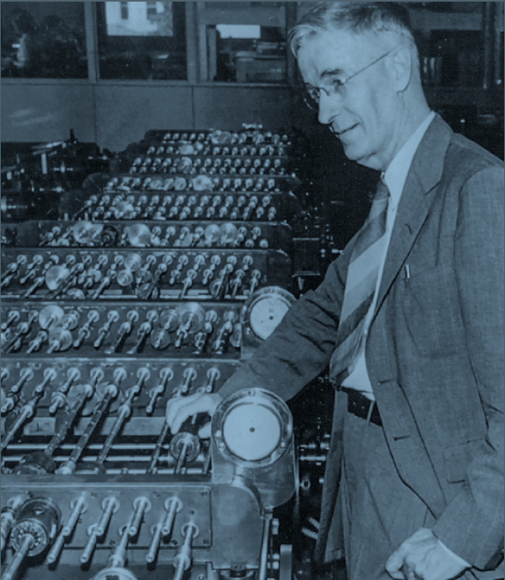

## 1864
### Pesan Spam Elektromagnetik Pertama
---
William Fothergill Cooke and Charles Wheatstone’s electromagnetic telegraph menggemparkan Inggris tak lama setelah layanan komersial dimulai pada tahun 1837. Pada tahun 1868, ada lebih dari 10.000 mil kabel telegraf di Inggris yang mendukung 1.300 stasiun telegraf; empat tahun kemudian, ada 5.179 stasiun, dilayani oleh lebih dari 87.000 mil kabel.

Dengan kemampuan untuk menjangkau sejumlah besar orang dengan cepat dan mudah, iklan elektrik pertama yang tidak diminta di dunia dikirim di London pada sore hari tanggal 29 Mei 1864, menurut sejarawan Matthew Sweet. Pesan itu dari Pak Gabriel, sekelompok dokter gigi yang tidak terdaftar, yang menjual berbagai macam gigi palsu, gusi, pasta gigi, dan bedak gigi.

##### _Pesan tersebut, yang dikirim ke anggota Parlemen saat ini dan sebelumnya, berbunyi sebagai berikut :_
##

_Tuan Gabriel, dokter gigi, jalan Harley, alun-alun Cavendish. Sampai Oktober kehadiran profesional Tuan Gabriel di 27, Harleystreet, akan 10 sampai 5._

 
Pada tahun 1864 tidak ada telegraf di tempat tinggal pribadi; pesan itu muncul di jarum ayun telegraf elektromagnetik Cooke-Wheatstone, di mana pesan itu ditranskripsikan oleh operator, dibawa oleh seorang anak laki-laki yang dikirim dari Perusahaan Telegraf Distrik London, dan diserahkan ke tangan seorang anggota Parlemen.

Anggota parlemen itu menulis tentang kekesalannya dalam sepucuk surat kepada editor surat kabar lokal : “Saya tidak pernah berurusan dengan Tuan Gabriel, dan mohon untuk mengetahui dengan hak apa mereka mengganggu saya dengan telegram yang hanya merupakan media iklan. ? Sepatah kata dari Anda, saya yakin, akan menghentikan gangguan yang tak tertahankan ini.”

Tapi itu bukan rasa malu yang menghentikan spam yang dikirim melalui telegram: itu adalah biayanya. Iklan melalui telegraf tidak efektif dari segi biaya, karena mahalnya biaya pengiriman pesan. Harga itu anjlok dengan lahirnya email, yang digunakan untuk mengirim iklan massal yang tidak diminta untuk pertama kalinya pada tahun 1978.

##### _Pada tanggal 29 Mei 1864, Tuan Gabriel, mengirimkan pesan elektronik paling awal yang tidak diminta kepada anggota Parlemen Inggris._

#
#
# 1890
## Tabulasi Sensus AS
#### **Herman Hollerith** (1860–1929)
---
Ketika Konstitusi AS diratifikasi, ia mengamanatkan bahwa pemerintah melakukan "pencacahan aktual" dari setiap orang bebas dalam serikat setiap 10 tahun. Seiring bertambahnya jumlah orang di negara itu, pencacahan membutuhkan waktu lebih lama dan lebih lama untuk diselesaikan. Sensus 1880 menghitung 50.189.209 orang. Butuh 31.382 orang untuk melakukan penghitungan dan delapan tahun untuk mentabulasi hasilnya, menghasilkan 21.458 halaman laporan yang diterbitkan. Jadi, pada tahun 1888, Biro Sensus mengadakan kompetisi untuk menemukan cara yang lebih baik untuk memproses dan mentabulasi data.

Penemu Amerika Herman Hollerith telah bekerja sebentar di Biro Sensus sebelum sensus 1880 dan pada tahun 1882 bergabung dengan fakultas MIT, di mana dia mengajar teknik mesin dan bereksperimen dengan sistem tabulasi mekanik. Sistem awalnya menggunakan gulungan pita kertas yang panjang dengan data yang direpresentasikan sebagai lubang berlubang. Kemudian, dalam perjalanan kereta api ke Amerika Barat, Hollerith melihat bagaimana kondektur membuat lubang pada tiket kertas yang sesuai dengan warna rambut seseorang, warna mata, dan sebagainya, sehingga tiket tidak dapat digunakan kembali oleh penumpang lain. Hollerith segera mengganti sistemnya untuk menggunakan kartu kertas.

Hollerith memasuki kompetisi 1888 dan menang, sistemnya secara dramatis lebih cepat daripada dua peserta lainnya. Pada tanggal 8 Januari 1889, ia dianugerahi paten AS pada "metode, sistem dan peralatan untuk menyusun statistik," awalnya diajukan 23 September 1884.

Sistem Hollerith terdiri dari kartu yang sedikit melengkung berukuran 3,25 by 7,375 inci (83 milimeter kali 187 milimeter). Seorang operator manusia membuat lubang di kartu dengan alat yang disebut _Pantographic Card Punch_, dengan lubang di lokasi tertentu untuk menandakan jenis kelamin seseorang, status perkawinan, ras, kepemilikan dan hutang pertanian dan rumah, dan informasi lainnya. Untuk tabulasi, kartu dilewatkan melalui pembaca dengan saklar mikro untuk mendeteksi keberadaan lubang dan sirkuit elektromekanis untuk melakukan tabulasi yang sebenarnya.

##### _Foto ini dari sensus AS 1940._

#
#
# 1891
## Strowger Step-by-Step Switch
#### **Almon Brown Strowger** (1839–1902)
---
Bell Telephone Company didirikan pada Juli 1877, dan pada tahun 1880-an berkembang pesat. Switchboard yang menghubungkan telepon bersama-sama dan menyelesaikan panggilan dijalankan secara manual oleh operator

Sistem telepon awal tidak memiliki dial atau tombol. Sebaliknya, ada engkol, terhubung ke generator listrik kecil. Pengguna akan mengangkat telepon dan memutar engkol, dan listrik akan mengalir melalui saluran telepon untuk memberi sinyal kepada operator.

Almon Strowger adalah seorang pengurus di Kansas City, Missouri. Dia memperhatikan bahwa bisnisnya telah menurun karena telepon menjadi lebih populer. Strowger mengetahui bahwa salah satu operator telepon menikah dengan pesaingnya, dan setiap kali ada panggilan telepon untuk pengurus, dia akan mengarahkan panggilan ke suaminya. Termotivasi, Strowger menemukan saklar langkah demi langkah, perangkat elektromekanis yang akan menyelesaikan sirkuit antara satu telepon dan bank lain tergantung pada urutan pulsa listrik yang dikirim ke saluran telepon. Alih-alih mengandalkan operator untuk terhubung, Strowger membayangkan bahwa orang akan mengetuk kode menggunakan sepasang tombol tekan.

Strowger, anggota keluarga, dan investor kemudian menciptakan Strowger Automatic Telephone Exchange Company pada tahun 1891. Mereka pergi ke La Porte, Indiana, yang baru-baru ini kehilangan sistem teleponnya karena sengketa paten antara operator independen lokal dan Bell Telephone System, dan mengatur pertukaran telepon otomatis pertama di dunia dengan panggilan langsung— setidaknya untuk panggilan lokal—pada tahun 1892.

Saklar itu disebut _"step-by-step"_ karena cara panggilan telepon diselesaikan, satu digit keluar pada satu waktu. Pertukaran selangkah demi selangkah tetap beroperasi di seluruh Amerika Serikat hingga 1999, ketika yang terakhir dihapus dari layanan, digantikan oleh pertukaran lokal terkomputerisasi #5ESS.

##### _Penggerak gesekan Rotary Western Electric 7A, No. 7001 Line Finder._

#
#
# 1914
## Floating-Point Numbers
#### **Leonardo Torres y Quevedo** (1852–1936), **William Kahan** (b. 1933)
---
Leonardo Torres y Quevedo adalah seorang insinyur dan matematikawan Spanyol yang senang membuat mesin praktis. Pada tahun 1906, ia mendemonstrasikan model perahu yang dikendalikan radio untuk raja Spanyol, dan ia merancang kapal udara semirigid yang digunakan dalam Perang Dunia I.

Torres juga penggemar mesin analisis dan perbedaan Babbage. Pada tahun 1913, ia menerbitkan _Esai_ dalam _Otomatisasi_,yang menggambarkan pekerjaan Babbage dan mempresentasikan desain mesin yang dapat menghitung nilai rumus a(y–z)2 untuk nilai tertentu dari _a, y, dan z_ .Untuk memungkinkan mesinnya menangani rentang angka yang lebih luas, Torres menemukan aritmatika titik-mengambang.

Aritmatika titik-mengambang memperluas jangkauan perhitungan numerik dengan mengurangi akurasinya. Alih-alih menyimpan semua angka dalam sebuah angka, komputer hanya menyimpan beberapa angka penting, yang disebut _signifikan_ ,dan eksponen yang jauh lebih pendek. “Angka” yang sebenarnya kemudian dihitung menggunakan rumus: signifikan dan basis ×eksponen

Misalnya, produk domestik bruto Amerika Serikat pada tahun 2016 adalah 18,57 triliun dolar. Menyimpan nomor itu dengan representasi titik tetap membutuhkan 14 digit. Tetapi menyimpannya dalam floating point hanya membutuhkan 6 digit: $18,57 triliun = 1,857 × 1013

Jadi, dengan bilangan floating-point, kadang-kadang disebut _notasi ilmiah_ pada kalkulator modern, register 10-digit (gadget mekanis atau elektronik yang dapat menyimpan angka) yang biasanya dibatasi untuk menyimpan angka antara 1 dan 9.999.999.999 malah dapat dipartisi menjadi angka penting 8-digit dan eksponen 2-digit, memungkinkannya untuk menyimpan nomor sekecil 0,0000001 × 10–99  dan sebesar 9,999999 × 1099.

Sistem floating-point modern menggunakan biner daripada angka desimal. Di bawah standar yang dikembangkan oleh matematikawan Kanada William Kahan untuk mikroprosesor Intel® 8086 dan diadopsi pada tahun 1985 oleh Institute of

Electrical and Electronics Engineers (IEEE 754), floating point presisi tunggal menggunakan 24 bit untuk signifikan dan 8 bit untuk eksponen.

##### _Potret Leonardo Torres y Quevedo oleh kartunis dan ilustrator Argentina Eulogia Merle (lahir 1976)._

#
#
# 1917
## Vernam Cipher
#### **Gilbert Vernam** (1890-1960), **Joseph Mauborgne**(1881–1971)

Kebanyakan algoritma enkripsi adalah _aman secara komputasi_. Ini berarti bahwa meskipun secara teoritis mungkin untuk memecahkan sandi dengan mencoba setiap kunci enkripsi yang mungkin, dalam praktiknya ini tidak mungkin karena mencoba semua kunci akan membutuhkan terlalu banyak daya komputasi.

Lebih dari seabad yang lalu, Gilbert Vernam dan Joseph Mauborgne datang dengan sistem kriptografi yang _secara teoritis aman_: bahkan dengan jumlah daya komputer yang tak terbatas, tidak mungkin untuk memecahkan pesan yang dienkripsi dengan Vernam Cipher, tidak peduli seberapa cepat komputer menjadi.

Vernam’s cipher , hari ini disebut _one-time pad_ ,tidak dapat dipecahkan karena pesan terenkripsi, didekripsi dengan kunci yang salah, dapat menghasilkan pesan yang tampak masuk akal. Memang, hal itu dapat mengakibatkan _setiap_ pesan yang mungkin, karena kuncinya sama panjangnya dengan pesan. Artinya, untuk setiap ciphertext yang diberikan, ada kunci yang membuatnya didekripsi sebagai ayat dari Alkitab, beberapa baris dari Shakespeare, dan teks di halaman ini. Tanpa cara untuk membedakan dekripsi yang benar dari dekripsi yang salah, cipher secara teoritis tidak dapat dipecahkan.

Bekerja di American Telephone and Telegraph Company (sekarang AT&T®) pada tahun 1917, Vernam menciptakan stream cipher yang mengenkripsi pesan satu karakter pada satu waktu dengan menggabungkan setiap karakter pesan dengan karakter kunci. Pada awalnya Vernam mengira kunci itu bisa jadi hanya pesan lain, tetapi tahun berikutnya, bekerja dengan Joseph Mauborgne, seorang kapten di Korps Sinyal Angkatan Darat AS, keduanya menyadari bahwa kunci itu pasti acak dan tidak berulang. Ini meningkatkan keamanan secara substansial: jika kuncinya adalah pesan lain, adalah mungkin untuk membedakan kunci yang mungkin dari yang tidak mungkin. Tetapi jika kuncinya benar-benar acak, maka kunci apa pun sama mungkinnya. Bersama-sama, kedua penemu menciptakan apa yang sekarang kita sebut sebagai pad satu kali, salah satu dari hanya dua sistem enkripsi yang diketahui yang terbukti tidak dapat dipecahkan (yang lainnya adalah kriptografi kuantum).

##### _Perangkat pad sekali pakai yang digunakan dengan sistem sandi SIGTOT yang digunakan di atas pesawat Douglas C-54 milik Presiden Roosevelt_

#
#
# 1920
## _Rossum’s Universal Robots_
#### **Karel Čapek** (1890–1938)
---
Kata _robot_ diciptakan pada tahun 1920 oleh dramawan Ceko Karel apek dalam hit fiksi ilmiahnya, RUR (Robot Universal Rossum). Dia menciptakan kata berdasarkan kata Ceko robot(“pekerja yang dipaksa"); kata itu sekarang banyak digunakan untuk makhluk mekanis di sebagian besar bahasa. Dalam drama tersebut, perusahaan fiksi Rossum telah mengembangkan mesin humanoid biologis murah yang disebut robot dan telah mengirimkannya ke seluruh dunia dari pabrik rahasianya yang berbasis di pulau. Sementara beberapa negara pada awalnya menggunakan robot sebagai tentara, akhirnya dunia kurang lebih menerima robot dan menggunakannya.

R. U. R termasuk banyak kiasan sastra yang akan menjadi biasa dalam literatur robot masa depan: sebuah organisasi bawah tanah yang berusaha untuk membebaskan robot; robot cerdas yang dirakit dari bagian-bagian, dengan rentang hidup yang pendek, tanpa rasa sakit, dan tanpa emosi; dan seorang ilmuwan yang menyenangkan dengan etika yang dipertanyakan. Mahal pada awalnya,R. U. R.’s harga robot turun dari $10.000 menjadi $150—dari sekitar $130.000 menjadi $2.000 dalam uang hari ini. Di dunia apek, perang adalah kenangan, angka kelahiran manusia menurun, dan masa depan tampaknya dapat diprediksi dan menyenangkan. 

Dan kemudian robot memutuskan untuk membunuh setiap manusia terakhir di planet ini. Meskipun sebagian besar dilupakan sekarang,R. U. R. diterima dengan baik dan populer. Drama tersebut diproduksi di Praha, London, New York, Chicago, dan Los Angeles. Ketika Isaac Asimov menulis Tiga Hukum Robotikanya, dia melakukannya sebagian besar untuk mencegah masa depan yang dibayangkan apek. Meskipun Čapek salah teknologi—ia membayangkan bahwa robot akan bersifat biologis, bukan berdasarkan mekanisme dan komputasi—visinya yang meyakinkan tentang dunia di mana umat manusia secara bersamaan dibantu, diubah, dan akhirnya dibekap oleh ciptaan mekanisnya masih menghantui kita hingga hari ini. 

##### _Sebuah poster untuk presentasi Proyek Teater Federal tentang RUR di Teater Marionette, 1936– 1939._

#
#
# 1927
## _Metropolis_
#### **Fritz Lang** (1890–1976)

Pada tahun 1927, sutradara film Jerman Fritz Lang sudah memvisualisasikan seperti apa kehidupan di tahun 2026 nanti. Teknologi tampil menonjol di lanskap kota dari film bisu hitam-putihnya Metropolis—yang dianggap oleh banyak orang sebagai salah satu film fiksi ilmiah paling berpengaruh sepanjang masa. Visi dystopian-nya menggambarkan pekerja yang tertindas di bawah tanah bekerja keras pada tugas-tugas berulang yang tidak ada artinya pada mesin yang menjalankan kota. Di atas tanah adalah surga di mana elit kota menjalani kehidupan yang memanjakan. Interpretasi dari dunia yang digerakkan oleh teknologi Lang dapat dilihat di film-film seperti _Blade Runner_.

Plot dari _Metropolis_ melibatkan robot wanita yang dibangun menyerupai istri almarhum pemimpin kota. Kemudian, ilmuwan gila yang menciptakannya mengubah tokoh utama dalam cerita—seorang pengasuh bernama Maria—menjadi robot wanita. Untuk menyelesaikan transformasi ini, ilmuwan menggunakan sejumlah besar energi listrik dan teknologi futuristik.

Sementara robot mewujudkan daya tarik manusia yang berkelanjutan dengan bagaimana kemajuan teknologi dapat berdampak dan berintegrasi ke dalam kehidupan manusia, fakta bahwa robot itu perempuan jarang terjadi. Kebanyakan robot yang ditampilkan dalam fiksi dan budaya pop pada masa itu adalah laki-laki atau tanpa gender. Robot ini—digambarkan sebagai istri pemimpin dan kemudian Maria—digambarkan sebagai sosok yang kuat dan feminin. Dampak budaya dari peran itu sejak itu terlihat dalam banyak karakter dan citra wanita, seperti selingan "Sweet Dreams" Beyoncé selama tur dunia, yang menampilkan video penyanyi dalam kostum robot yang sangat mirip dengan "Maria."

##### _Sebuah poster untuk rilisan ulang tahun 1984 dariMetropolis,film tahun 1927 karya sutradara film Jerman Fritz Lang._

#
#
# 1927
## LED pertama
#### **Oleg Vladimirovich Losev** (1903–1942)

Meskipun sifat electroluminescent beberapa kristal ditemukan di Inggris pada tahun 1907, butuh lebih dari satu dekade kerja oleh ilmuwan Rusia otodidak Oleg Vladimirovich Losev untuk mengembangkan teori (berdasarkan teori fotolistrik Einstein) tentang bagaimana efeknya bekerja, dan untuk menghasilkan perangkat yang dapat digunakan dalam aplikasi praktis. Secara total, Losev menerbitkan 16 makalah akademis yang muncul di jurnal ilmiah Rusia, Inggris, dan Jerman antara tahun 1924 dan 1930, yang secara komprehensif menjelaskan perangkat dalam prosesnya. Dia melanjutkan untuk datang dengan aplikasi baru untuk dioda pemancar cahaya (LED dan semikonduktor lainnya, termasuk "perangkat relai cahaya," penerima radio, dan penguat solid-state, sebelum mati kelaparan selama Pengepungan Leningrad pada tahun 1942.

LED ditemukan kembali pada tahun 1962 oleh empat kelompok peneliti Amerika yang berbeda. Kali ini teknologi tidak akan hilang. Dibandingkan dengan tabung pijar, neon, dan nixie hari itu, LED mengkonsumsi daya jauh lebih sedikit dan praktis tidak menghasilkan panas. Mereka hanya memiliki tiga kelemahan: mereka hanya dapat menghasilkan lampu merah, tidak terlalu terang, dan harganya sangat mahal—masing-masing lebih dari $200 pada awalnya.

Pada tahun 1968, peningkatan produksi memungkinkan perusahaan menekan harga LED masing-masing menjadi lima sen. Pada harga itu, LED mulai muncul di kalkulator, jam tangan, peralatan laboratorium, dan, tentu saja, komputer. Memang, LED diatur sebagai lampu individu dan tampilan numerik tujuh segmen adalah salah satu output utama untuk generasi pertama mikrokomputer pada pertengahan 1970-an. Bahkan LED awal dapat dinyalakan dan dimatikan jutaan kali per detik, sehingga penggunaannya dalam komunikasi serat optik. Pada tahun 1980, LED inframerah mulai muncul di remote televisi.

Meskipun LED biru dan ultraviolet ditemukan pada 1970-an, sejumlah terobosan diperlukan untuk membuatnya cukup terang untuk penggunaan praktis. Hari ini tantangan tersebut telah diatasi. Memang, lampu rumah LED putih terang yang sebagian besar telah menggantikan bola lampu pijar dan lampu neon didasarkan pada LED ultraviolet yang merangsang fosfor putih.

##### _Delapan dekade setelah ditemukan pada tahun 1927, dioda pemancar cahaya akhirnya cukup terang dan cukup murah untuk menggantikan bola lampu pijar dalam skala besar._

# 1928
##  Electronic Speech Synthesis
###
#### **Homer Dudley** (1896–1980)
------

#

Jauh sebelum Siri®, Alexa, Cortana, dan Electronic Speech Synthesis lainnya membaca email, memberi tahu orang-orang tentang waktu, dan memberikan petunjuk arah mengemudi, para ilmuwan riset sedang menjajaki pendekatan untuk membuat suara seseorang menggunakan lebih sedikit bandwidth saat bergerak melalui sistem telepon.

Pada tahun 1928, Homer Dudley, seorang insinyur di Bell Telephone Labs, mengembangkan **vocoder**, sebuah proses untuk mengompresi ukuran ucapan manusia menjadi transmisi elektronik yang dapat dipahami dan membuat ucapan sintetis dari awal di ujung yang lain dengan meniru suara dari pita suara manusia. Vocoder menganalisis ucapan nyata dan memasangnya kembali sebagai kesan elektronik yang disederhanakan dari bentuk gelombang aslinya. Untuk menciptakan kembali suara ucapan manusia, ia menggunakan suara dari osilator, tabung pelepasan gas (untuk suara mendesis), filter, dan komponen lainnya.

Pada tahun 1939, Bell Labs yang berganti nama meluncurkan _speech synthesizer_ di Pameran Dunia New York. Disebut **_Voder_**, itu dioperasikan secara manual oleh manusia, yang menggunakan serangkaian kunci dan pedal kaki untuk menghasilkan desis, nada, dan dengungan, membentuk vokal, konsonan, dan ucapan yang akhirnya dapat dikenali.

Vocoder mengikuti jalur perkembangan teknologi yang berbeda dari Voder. Pada tahun 1939, dengan pecahnya perang di Eropa, Bell Labs dan pemerintah AS menjadi semakin tertarik untuk mengembangkan semacam komunikasi suara yang aman. Setelah penelitian tambahan, vocoder dimodifikasi dan digunakan dalam Perang Dunia II sebagai komponen encoder dari sistem suara aman yang sangat sensitif yang disebut SIGSALY yang digunakan Winston Churchill untuk berbicara dengan Franklin Roosevelt.

Kemudian di tahun 1960-an, vocoder membuat lompatan ke dalam musik dan budaya pop. Itu terus digunakan untuk berbagai suara, termasuk melodi elektronik dan robot berbicara, serta efek distorsi suara dalam musik tradisional. Pada tahun 1961, komputer pertama yang bernyanyi adalah **_International Business Machines Corporation (IBM®) 7094_**, menggunakan vocoder untuk menyanyikan lagu “Daisy Bell.” (Ini adalah nada yang sama yang akan digunakan tujuh tahun kemudian oleh komputer HAL 9000 di Stanley Kubrick's _2001: A Space Odyssey_.) Pada tahun 1995, 2Pac, Dr. Dre, dan Roger Troutman menggunakan vocoder untuk mendistorsi suara mereka dalam lagu “California Love,” dan pada tahun 1998 Beastie Boys menggunakan vokal bervokode dalam lagu mereka “Intergalactic.”

##### _Voder, dipamerkan oleh Bell Telephone di Pameran Dunia New York._

# 1931

## Differential Analyzer
### Penganalisis Differensial
#### **Bush** (1890–1974), **Harold Locke Hazen** (1901–1980)
---

#
Penganalisis diferensial digunakan untuk menggambarkan dan memprediksi perilaku berbagai fenomena di dunia kita yang terus berubah dan kompleks. Mereka dapat memprediksi ketinggian gelombang laut, pertumbuhan populasi, seberapa jauh bola bisbol dapat terbang, seberapa cepat plastik akan membusuk, dan sebagainya. Beberapa misteri matematika ini dapat dipecahkan dengan tangan, tetapi skenario lain yang lebih kompleks seperti simulasi ledakan nuklir terlalu padat karya dan rumit untuk pendekatan manual. Untuk mengatasi keterbatasan ini, dibutuhkan mesin dalam membantu kognisi manusia. 

Dirancang dan dibangun di MIT antara tahun 1928 dan 1931 oleh Vannevar Bush dan mahasiswa pascasarjananya Harold Locke Hazen, penganalisis diferensial menggabungkan enam integrator mekanis, memungkinkan persamaan diferensial kompleks untuk dianalisis. Bush merancang penganalisa diferensial sebagian karena dia telah mencoba memecahkan persamaan diferensial yang memerlukan beberapa urutan integrasi. Dia pikir akan lebih cepat untuk merancang dan membangun mesin untuk memecahkan persamaan yang dia hadapi, daripada menyelesaikan persamaan secara langsung.

Sebuah komputer analog, penganalisis diferensial menggunakan motor listrik untuk menggerakkan berbagai roda gigi dan poros yang menggerakkan enam integrator roda dan cakram yang terhubung ke 18 poros berputar. Lusinan alat analisa dibangun sesuai dengan rencana awal. Itu adalah mesin terobosan yang memungkinkan kemajuan dibuat dalam memahami seismologi, jaringan listrik, meteorologi, dan perhitungan balistik.

Karena itu mekanis, ketidaksempurnaan dalam pemesinan, atau keausan sederhana pada bagian-bagiannya, membuat setiap hasil analisa menjadi kurang akurat dari waktu ke waktu. Itu juga lambat untuk diatur. Jadi setelah menjadi direktur Carnegie Institution for Science di Washington, DC, pada tahun 1938, Bush mulai mengerjakan mesin pengganti, berdasarkan tabung, yang disebut _Rockefeller_ Penganalisis Diferensial. Selesai pada tahun 1942, ia memiliki 2.000 tabung dan 150 motor dan merupakan mesin penghitung penting dalam Perang Dunia II.

##### _Vannevar Bush dengan penganalisa diferensialnya, komputer mekanis yang dirancang untuk menyelesaikan persamaan diferensial._

# 1936

## Church-Turing Thesis

### Tesis Turing-Gereja

#### **David Hilbert** (1862–1943), **Alonzo Church** (1903–1995), **Alan Turing** (1912–1954)
---

#
Teori ilmu komputer berusaha menjawab dua pertanyaan mendasar tentang sifat komputer dan komputasi: apakah ada batasan teoretis mengenai apa yang mungkin untuk dihitung, dan apakah ada batasan praktis?

    Matematikawan Amerika Alonzo Church dan ilmuwan komputer Inggris Alan Turing masing-masing menerbitkan jawaban atas pertanyaan-pertanyaan ini pada tahun 1936. Mereka melakukannya dengan menjawab tantangan yang diajukan oleh matematikawan terkemuka Jerman David Hilbert delapan tahun sebelumnya.

Tantangan Hilbert, Masalah _Entscheidung_ (Bahasa Jerman untuk "masalah keputusan"), menanyakan apakah ada prosedur matematis—algoritme yang dapat diterapkan untuk menentukan apakah proposisi matematis yang diberikan benar atau salah. Hilbert pada dasarnya bertanya apakah pekerjaan inti matematika, pembuktian teorema, itu dapat diotomatisasi.

Church menjawab Hilbert dengan mengembangkan cara baru untuk menggambarkan fungsi matematika dan teori bilangan yang disebut _Kalkulus Lambda_. Dengan itu, dia menunjukkan bahwa _Masalah Entscheidung_ tidak dapat diselesaikan secara umum: tidak ada prosedur algoritmik umum untuk membuktikan atau menyangkal teorema. Dia menerbitkan makalahnya pada bulan April 1936.

Turing mengambil pendekatan yang sangat berbeda: dia menciptakan definisi matematis dari mesin abstrak sederhana yang dapat melakukan komputasi. Turing kemudian menunjukkan bahwa mesin seperti itu pada prinsipnya dapat melakukan komputasi apa pun dan menjalankan algoritme apa pun—bahkan dapat mensimulasikan pengoperasian mesin lain. Akhirnya, dia menunjukkan bahwa meskipun mesin seperti itu dapat menghitung hampir semua hal, tidak ada cara untuk mengetahui apakah suatu perhitungan pada akhirnya akan selesai, atau apakah itu akan berlanjut selamanya. Dengan demikian, _Masalah Entscheidung_ tidak terpecahkan.

Turing pergi ke Universitas Princeton pada bulan September 1936 untuk belajar dengan Church, di mana keduanya menemukan bahwa pendekatan yang sangat berbeda sebenarnya, secara matematis setara. Makalah Turing diterbitkan pada November 1936; dia bertahan dan menyelesaikan PhD-nya pada Juni 1938, dengan Church sebagai penasihat PhD-nya.

 
##### _Patung Alan Turing di Bletchley Park, pusat operasi pemecah kode Inggris selama Perang Dunia II._

# 1941

## Z3 Computer
### Computer Z3
#### **Konrad Zuse**  (1910–1995)
---

#

Z3 adalah komputer digital pertama yang dapat diprogram dan bekerja sepenuhnya otomatis di dunia. Mesin menjalankan program pada pita seluloid yang dilubangi dan dapat melakukan penjumlahan, pengurangan, perkalian, pembagian, dan akar kuadrat pada bilangan floating-point biner 22-bit (karena matematika biner lebih efisien daripada desimal); itu memiliki 64 kata memori 22-bit untuk menyimpan hasil. Mesin dapat mengubah titik float desimal ke biner untuk input, dan titik float biner kembali ke desimal untuk output.

Lulus dengan gelar di bidang teknik sipil pada tahun 1935, penemu Jerman Konrad Zuse segera mulai membangun komputer pertamanya, Z1 (dibangun 1935-1938), di apartemen orang tuanya di Berlin. **Z1** adalah kalkulator mekanis yang dikendalikan oleh lubang yang dibuat dalam film seluloid. Mesin menggunakan bilangan floating-point biner 22-bit dan mendukung logika Boolean; itu dihancurkan pada bulan Desember 1943 selama serangan udara Sekutu.

Direkrut menjadi dinas militer pada tahun 1939, Zuse mulai mengerjakan **Z2** (1939), yang meningkatkan desain Z1 dengan menggunakan relai telepon untuk logika aritmatika dan kontrol. DVL, Institut Penelitian Penerbangan Jerman, terkesan dengan Z2 dan memberi Zuse dana untuk memulai perusahaannya, Zuse Apparatebau (Zuse Apparatus Construction, kemudian berganti nama menjadi Zuse KG), untuk membangun mesin.

Pada tahun 1941, Zuse merancang dan membangun **Z3**. Seperti Z1 dan Z2, ia dikendalikan oleh pita seluloid berlubang, tetapi juga memiliki dukungan untuk loop, memungkinkannya digunakan untuk menyelesaikan banyak perhitungan teknik yang khas.

Dengan keberhasilan Z3, Zuse mulai mengerjakan **Z4**, mesin yang lebih bertenaga dengan matematika floating-point 32-bit dan lompatan bersyarat. Mesin yang selesai sebagian dipindahkan dari Berlin ke Göttingen pada Februari 1945 untuk mencegahnya jatuh ke tangan Soviet, dan selesai di sana tepat sebelum akhir perang. Itu tetap beroperasi sampai tahun 1959.

Anehnya, tampaknya militer Jerman tidak pernah menggunakan mesin canggih ini, sebaliknya mesin tersebut sebagian besar didanai sebagai proyek penelitian.

###### _Konsol kontrol, kalkulator, dan lemari penyimpanan komputer Z3 oleh Konrad Zuse._

# 1942

## Atanasoff-Berry Computer
### Komputer Atanasoff-Berry
#### **John Vincent Atanasoff** (1903–1995), **Clifford Edward Berry** (1918–1963)
---

Dibangun di Iowa State College (sekarang Iowa State University) oleh profesor John Atanasoff dan mahasiswa pascasarjana Clifford Berry, **Atanasoff-Berry Computer (ABC) adalah komputer desktop digital elektronik otomatis**.

##### Atanasoff, seorang fisikawan dan penemu, menciptakan ABC untuk memecahkan sistem umum persamaan linier hingga 29 yang tidak diketahui. Pada saat itu, komputer manusia membutuhkan waktu delapan jam untuk menyelesaikan sistem dengan delapan hal yang tidak diketahui; sistem dengan lebih dari 10 yang tidak diketahui tidak sering dicoba. Atanasoff mulai membangun komputer pada tahun 1937; dia berhasil mengujinya pada tahun 1942, dan kemudian meninggalkannya ketika dia dipanggil untuk bertugas di Perang Dunia II. Meskipun mesin itu sebagian besar dilupakan, itu mengubah arah komputasi beberapa dekade kemudian.

Mesin didasarkan pada elektronik, bukan relay dan sakelar mekanis, melakukan matematika dengan aritmatika biner, dan memiliki memori utama yang menggunakan muatan listrik (atau ketiadaannya) dalam kapasitor kecil untuk mewakili 1s dan 0s pendekatan yang sama yang digunakan oleh modul _modern dynamic random access memory (DRAM)_. Seluruh komputer beratnya 700 pon.

Ironisnya, nilai abadi dari ABC adalah untuk membatalkan paten ENIAC asli, yang telah diajukan oleh J. Presper Eckert dan John Mauchly pada bulan Juni 1947. Paten ENIAC adalah subyek litigasi substansial, dan US Patent and Trademark Office melakukannya tidak mengeluarkan paten sampai tahun 1964 sebagai hasilnya. Dengan paten di tangan, perusahaan elektronik Amerika Sperry Rand (yang telah membeli Eckert-Mauchly Computer Corporation pada tahun 1950) segera menuntut biaya besar dari semua perusahaan yang menjual komputer. Pada saat itu, paten berlaku selama 18 tahun sejak tanggal penerbitan, yang berarti bahwa paten ENIAC dapat melumpuhkan industri komputasi hingga tahun 1982.

Ternyata Mauchly pernah mengunjungi Iowa State dan mempelajari ABC pada Juni 1941—tetapi gagal menyebutkan ABC sebagai karya sebelumnya dalam permohonan patennya. Pada tahun 1967, Honeywell® menggugat Sperry Rand, mengklaim bahwa paten tidak valid karena kelalaian. Pengadilan Distrik AS untuk Distrik Minnesota menyetujui dan membatalkan paten ENIAC enam tahun kemudian.

##### _Rekonstruksi kerja Komputer Atanasoff-Berry, yang dibangun oleh para insinyur di Iowa State University antara 1994 dan 1997._

#

## Isaac Asimov’s Three Laws of Robotics
### Tiga Hukum Robotika Isaac Asimov
#### **Isaac Asimov** (1920–1992)
---

Penulis fiksi ilmiah Isaac Asimov memperkenalkan Tiga Hukum Robotika dalam kisahnya tahun 1942 “Runaround” sebagai seperangkat prinsip panduan untuk mengatur perilaku robot dan perkembangannya di masa depan. Pertama, robot tidak boleh membahayakan manusia, baik karena tindakan atau kelambanan robot. Kedua, robot harus mengikuti perintah manusia, kecuali mereka melanggar hukum pertama. Hukum ketiga menyatakan bahwa robot harus menjaga kelangsungan hidup mereka sendiri, asalkan hal itu tidak mengganggu kewajiban mereka berdasarkan hukum pertama dan kedua.
#

##### Asimov menambahkan hukum keempat, yang dikenal sebagai hukum “nol”, pada tahun 1985. Hukum ini berperingkat lebih tinggi dari tiga hukum pertama dan memberikan perlindungan serupa kepada seluruh umat manusia.

#

Asimov awalnya mengaitkan hukum dengan _Buku Pegangan Robotika_, Edisi ke-56, 2058 M _Hukum_ adalah fitur gagal-aman yang digunakan untuk menginformasikan perilaku robot saat robot berinteraksi dengan manusia dan memilih tindakan yang melibatkan moralitas, etika, dan pengambilan keputusan yang bijaksana. Mereka digunakan di seluruh seri Robot dan narasi lain yang terkait dengannya. Misalnya, Dr. Susan Calvin, seorang robopsychologist, adalah karakter fiksi yang berulang dalam cerita robot Asimov. Calvin dipekerjakan oleh produsen robot abad ke-21 US Robots and Mechanical Men, Inc., di mana ia memecahkan masalah yang disebabkan oleh interaksi robot dengan manusia. Masalah-masalah ini sering dikaitkan dengan istilah dalam cerita Asimov yang disebut "Frankenstein Complex," yang dipahami sebagai ketakutan manusia terhadap mesin otonom yang sadar diri.

Asimov menyadari dalam tulisannya bahwa kecemasan tentang robot cerdas akan menjadi tantangan yang signifikan untuk diatasi agar robot dapat diterima oleh masyarakat manusia. Hukumnya menyentuh subjek yang telah beralih dari fiksi ke kebijakan publik ketika masyarakat menghadapi komersialisasi mesin (seperti kendaraan otonom) yang fungsinya terkait langsung dengan kehidupan manusia.

##### Sampul Signet edisi 1956 dari I robot oleh Isaac Asimov.

# 1943

## ENIAC
#### **John Mauchly** (1907–1980), **J. Presper Eckert** (1919–1995)
---

#

ENIAC adalah elektronik komputer yang pertama, yang berarti dihitung dengan tabung daripada relay. Dirancang oleh John Mauchly dan J. Presper Eckert di Moore School of Electrical Engineering di University of Pennsylvania, ENIAC memiliki 17.468 tabung vakum, tingginya 8 kaki (2,4 meter) kali 3 kaki (0,9 meter) dengan panjang kedalaman 100 kaki (30,5 meter), dan beratnya lebih dari 30 ton.

ENIAC memiliki pembaca kartu punch IBM untuk input dan kartu punch untuk output, tetapi mesin tidak memiliki memori untuk data atau program. Sebagai gantinya, angka yang dihitung disimpan di salah satu dari 20 akumulator komputer, yang masing-masing dapat menyimpan 10 angka desimal dan melakukan penambahan atau pengurangan. Perangkat keras lain dapat melakukan perkalian, pembagian, dan bahkan akar kuadrat. ENIAC tidak diprogram dalam pengertian hari ini. Sebagai gantinya, satu set panel memiliki 1.200 sakelar putar 10 posisi yang akan memberi energi pada sirkuit yang berbeda dalam urutan tertentu, menyebabkan representasi elektronik dari angka mengalir melalui bagian mesin yang berbeda pada waktu yang telah ditentukan, dan memimpin perhitungan mesin untuk dilakukan.

ENIAC dibangun untuk melakukan perhitungan balistik yang kompleks untuk Angkatan Darat AS, tetapi John von Neumann (1903–1957) di Proyek Manhattan belajar tentang ENIAC, jadi penggunaan resmi pertama mesin itu sebenarnya untuk melakukan **perhitungan untuk pengembangan bom hidrogen.**

Ironisnya, orang yang membuat perangkat keras tidak pernah mempertimbangkan kebutuhan, atau kerumitan, memprogram mesin. Mereka meninggalkan pekerjaan membuat mesin benar-benar menghitung ke enam komputer manusia: Frances “Betty” Snyder Holberton (1917–2001), Betty “Jean” Jennings Bartik (1924–2011), Kathleen McNulty Mauchly Antonelli (1921–2006), Marlyn Wescoff Meltzer (1922–2008), Ruth Lichterman Teitelbaum (1924–1986), dan Frances Bilas Spence (1922–2012).

Wanita-wanita itu, beberapa programmer pertama di dunia, harus merancang dan kemudian men-debug algoritma mereka sendiri. Tetapi para wanita tidak diakui pada waktunya sendiri. Pada tahun 2014, Kathy Kleiman memproduksi film dokumenter Komputer, yang akhirnya menceritakan kisah wanita.

##### ENIAC, komputer elektronik pertama, dibuat untuk melakukan perhitungan untuk Angkatan Darat AS. Digambarkan sedang mengoperasikan mesin itu adalah Kopral Irwin Goldstein, Homer Spence Private First Class, Betty Jean Jennings, dan Frances Bilas.

#

## Colossus
#### **Thomas Harold Flowers** (1905–1998), **Sidney Broadhurst** (1893–1969), **W. T. Tutte** (1917–2002)
---

#

Colossus adalah mesin komputasi digital elektronik pertama, yang dirancang dan berhasil digunakan selama Perang Dunia II oleh Inggris untuk memecahkan kode militer Komando Tinggi Jerman. **"Elektronik"** berarti dibangun dengan tabung, yang membuat Colossus bekerja lebih dari 500 kali lebih cepat daripada mesin komputasi berbasis relai saat itu. Itu juga komputer pertama yang diproduksi dalam jumlah banyak.

Sebanyak 10 "Colossi" dibangun secara sembunyi-sembunyi di Bletchley Park, pusat cryptanalytic ultra-rahasia Inggris Perang Dunia II, antara tahun 1943 dan 1945 untuk memecahkan sinyal telegraf nirkabel yang dienkripsi dengan sistem khusus yang dikembangkan oleh C. Lorenz AG, sebuah perusahaan elektronik Jerman. Setelah perang Colossi dihancurkan atau dibongkar untuk bagian mereka untuk melindungi rahasia kecakapan cryptanalytic Inggris.

##### Colossus jauh lebih canggih daripada mesin Bombe elektromekanis yang dirancang Alan Turing untuk memecahkan sandi Enigma yang lebih sederhana yang digunakan oleh Jerman untuk enkripsi medan perang. Sementara Enigma menggunakan antara tiga dan delapan rotor enkripsi untuk mengacak karakter, sistem Lorenz melibatkan 12 roda, dengan masing-masing roda menambahkan lebih banyak kompleksitas matematis, dan dengan demikian membutuhkan mesin pengurai sandi dengan kecepatan dan kelincahan yang jauh lebih tinggi.

#

##### Tabung elektronik memberi Colossus kecepatan yang dibutuhkannya. Tetapi kecepatan itu berarti bahwa Colossus membutuhkan sistem input yang sama cepatnya. Itu menggunakan pita kertas berlubang yang berjalan pada 5.000 karakter per detik, pita itu sendiri bergerak dengan kecepatan 27 mil per jam. Rekayasa yang cukup besar membuat pita itu dikencangkan dengan benar, mencegah robekan dan robekan.

#

Kelincahan diberikan oleh teknik kriptanalisis yang dirancang oleh Alan Turing yang disebut __Turingery__, yang menyimpulkan pola kriptografi dari setiap roda cipher Lorenz, dan algoritma kedua. **Algoritma kedua**, dirancang oleh ahli matematika Inggris WT Tutte, menentukan posisi awal roda, yang diubah oleh Jerman untuk setiap kelompok pesan. Colossi sendiri dioperasikan oleh sekelompok cryptanalysts yang mencakup 272 wanita dari Women's Royal Naval Service (WRNS) dan 27 pria.

##### _Mesin komputasi Colossus digunakan untuk membaca kode Nazi di Bletchley Park, Inggris, selama Perang Dunia II._

# 1944

## Delay Line Memory
#### **John Mauchly** (1907–1980), **J. Presper Eckert** (1919–1995), **Maurice Wilkes** (1913–2010)
---

#

Sistem komputer awal membutuhkan cara untuk memprogram data yang cepat, dapat ditulis ulang, dan dapat diperluas. Beberapa melakukannya dengan mengubah bit menjadi pulsa suara dan mengirimkan pulsa tersebut ke tabung panjang yang disebut agaris tunda. Tabung awal dapat menampung 576 bit, berputar di sekitar perangkat.

J. Presper Eckert menemukan garis penundaan merkuri selama Perang Dunia II untuk sistem radar analog. Dengan hati-hati mengatur waktu pulsa radar dengan panjang garis tunda, adalah mungkin untuk membangun tampilan yang hanya akan menunjukkan target bergerak. Pada tahun 1944, Eckert mengadopsi memori saluran tunda merkuri ke komputer EDVAC yang dia rakit di Philadelphia. Eckert dan Mauchly mengajukan Paten AS 2.629.827, "Sistem memori," pada tanggal 31 Oktober 1947; itu tidak diberikan sampai tahun 1953, dimana garis waktu tunda sudah usang.

Dalam garis tunda, komputer menyimpan 1 dengan mengirimkan pulsa elektronik ke transduser, yang menciptakan gelombang ultrasonik. Gelombang berjalan dari satu ujung ke ujung yang lain, di mana ia diubah kembali menjadi listrik, dibentuk kembali dan diperkuat, mengubahnya sekali lagi menjadi 1 murni, dan akhirnya dikirim melalui kabel ke transduser asli, di mana 1 disuntikkan kembali ke dalam sedang. A 0 ditunjukkan dengan tidak adanya pulsa. Elektronik yang menyertai digunakan untuk membaca atau menulis data pada titik tertentu dalam urutan saat bit berputar.

Sementara pengerjaan EDVAC dilanjutkan, Maurice Wilkes di Laboratorium Matematika Universitas Cambridge di Inggris menyempurnakan teknologi dan membangun Kalkulator Otomatis Penyimpanan Penundaan Elektronik (EDSAC). Beroperasi pada Mei 1949, EDSAC adalah sistem pertama yang menggunakan jalur tunda untuk penyimpanan digital. EDVAC beroperasi tidak lama kemudian. Eckert dan Mauchly kemudian menempatkan garis tunda di UNIVAC® I (Komputer Otomatis Universal) yang mereka jual ke Biro Sensus AS dan pelanggan lainnya.

Garis tunda kemudian berdasarkan gelombang kompresi magnetik mengemas lebih dari 10.000 bit menjadi kira-kira satu kaki kawat melingkar. Sangat andal, garis tunda ini digunakan di komputer, tampilan video, dan kalkulator desktop hingga pertengahan 1960- an. Wilkes dianugerahi Penghargaan AM Turing pada tahun 1967.

##### _Ilmuwan komputer Inggris Maurice Wilkes berlutut di samping komputer EDSAC yang menunda memori saluran merkuri._

__Pada tahun 1928__, Homer Dudley mengembangkan __Vocoder__ untuk mengompresi ukuran ucapan manusia agar dapat dipahami. Selanjutnya pada tahun 1939, Bell Labs mengganti nama vocoder menjadi __Speech Synthesizer__ dengan kegunaan meningkat yakni dapat menghasilkan desis, nada dan dengungan yang membentuk vokal, konsonan dan ucapan yang akhirnya dapat dikenali. Kemudian di tahun 1960-an vocoder membuat lompatan ke dalam musik dan budaya pop. Pada tahun 1961, komputer pertama yang bernyanyi adalah International Business Machines Corporation (IBM®) 7094, menggunakan vocoder untuk menyanyikan lagu “Daisy Bell.” _Voder, dipamerkan oleh Bell Telephone di Pameran Dunia New York._

__Antara tahun 1928 dan 1931__ dirancang dan dibangun __Penganalisis Diferensial__ oleh Vannevar Bush dan mahasiswa pascasarjananya Harold Locke Hazen. Penganalisis diferensial menggabungkan enam integrator mekanis, memungkinkan persamaan diferensial kompleks untuk dianalisis. Akan tetapi masih terdapat ketidaksempurnaan pada alat ini yang selanjutnya pada tahun 1938 Bush mulai mengerjakan mesin pengganti, berdasarkan tabung yang disebut __Rockefeller__ Penganalisis Diferensial. Selesai pada tahun 1942, ia memiliki 2.000 tabung dan 150 motor dan merupakan mesin penghitung penting dalam Perang Dunia II.

__Selanjutnya pada tahun 1936__, Chruch menjawab tantangan Hilbert mengenai algoritma menentukan proposisi matematis yang diberikan benar atau salah dengan membuat teori _Kalkulus Lambda_. Berbeda dengan Chruch, turing menciptakan definisi matematis dari mesin abstrak sederhana yang dapat melakukan komputasi. Akan tetapi masalah tidak terpecahkan. Turing pergi ke Universitas Princeton pada bulan September 1936 untuk belajar dengan Church, di mana keduanya menemukan bahwa pendekatan yang sangat berbeda sebenarnya, secara matematis setara. Makalah Turing diterbitkan pada November 1936; dia bertahan dan menyelesaikan PhD-nya pada Juni 1938, dengan Church sebagai penasihat PhD-nya.

__Pada tahun 1935-1938__ dibangun __komputer Z1__ oleh Jerman Konrad Zuse sebagai kalkulator mekanis yang dikendalikan oleh lubang yang dibuat dalam film seluloid. Pada 1939, Zuse mengembangkan __Z2__ dengan meningkatkan desain Z1 dengan menggunakan relai telepon untuk logika aritmatika dan kontrol. Pada tahun 1941, Zuse merancang dan membangun __Z3__. Seperti Z1 dan Z2, ia dikendalikan oleh pita seluloid berlubang, tetapi juga memiliki dukungan untuk loop, memungkinkannya digunakan untuk menyelesaikan banyak perhitungan teknik yang khas.Dengan keberhasilan Z3, Zuse mulai mengerjakan __Z4__, mesin yang lebih bertenaga dengan matematika floating-point 32-bit dan lompatan bersyarat.

__Pada tahun 1942__ dibangun di Iowa State College (sekarang Iowa State University) oleh profesor John Atanasoff dan mahasiswa pascasarjana Clifford Berry, Atanasoff-Berry Computer (ABC) adalah komputer desktop digital elektronik otomatis.

Selanjutnya penulis fiksi ilmiah Isaac Asimov memperkenalkan Tiga Hukum Robotika dalam kisahnya tahun 1942 “Runaround” sebagai seperangkat prinsip panduan untuk mengatur perilaku robot dan perkembangannya di masa depan. Asimov menyadari dalam tulisannya bahwa kecemasan tentang robot cerdas akan menjadi tantangan yang signifikan untuk diatasi agar robot dapat diterima oleh masyarakat manusia. 

Kemudian __pada tahun 1943__ John Mauchly dan J. Presper Eckert di Moore School of Electrical Engineering di University of Pennsylvania merancang __ENIAC__. ENIAC, komputer elektronik pertama, dibuat untuk melakukan perhitungan untuk Angkatan Darat AS. Perkembangan selanjutnya ada __Colossus__. Mesin komputasi Colossus digunakan untuk membaca kode Nazi di Bletchley Park, Inggris, selama Perang Dunia II.

Setelah itu J. Presper Eckert menemukan __Delay Line Memory__ merkuri selama Perang Dunia II untuk sistem radar analog. Pada tahun 1944, Eckert mengadopsi memori saluran tunda merkuri ke komputer EDVAC yang dia rakit di Philadelphia. Sementara pengerjaan EDVAC dilanjutkan, Maurice Wilkes di Laboratorium Matematika Universitas Cambridge di Inggris menyempurnakan teknologi dan membangun Kalkulator Otomatis Penyimpanan Penundaan Elektronik (EDSAC). Beroperasi pada Mei 1949, EDSAC adalah sistem pertama yang menggunakan jalur tunda untuk penyimpanan digital. EDVAC beroperasi tidak lama kemudian. Eckert dan Mauchly kemudian menempatkan garis tunda di UNIVAC® I (Komputer Otomatis Universal) yang mereka jual ke Biro Sensus AS dan pelanggan lainnya.
