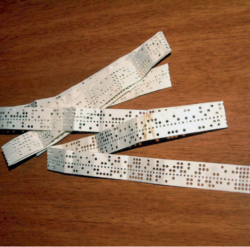
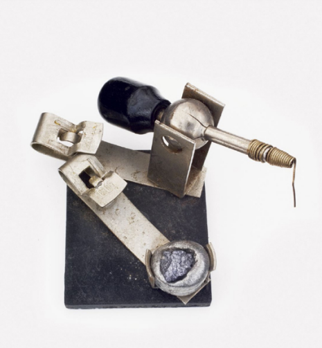

# 1874
## Baudot Code
#### **Jean-Maurice-Émile Baudot** (1845–1903), **Donald Murray** (1865–1945)
---
#
Sistem telegraf awal mengandalkan operator manusia untuk mengkodekan dan mengirimkan pesan pengirim, dan kemudian untuk memahami, memecahkan kode, dan menyalin pesan di atas kertas setelah diterima. Mengandalkan operator manusia membatasi kecepatan maksimum di mana pesan dapat dikirim dan membutuhkan keterampilan operator yang tidak mudah tersedia.

Émile Baudot mengembangkan pendekatan yang lebih baik. Seorang operator telegraf Prancis terlatih, Baudot merancang sebuah sistem yang menggunakan keyboard khusus dengan lima tombol (dua untuk tangan kiri dan tiga untuk kanan) untuk mengirim setiap karakter. Tiga puluh satu kombinasi berbeda muncul dari menekan satu atau lebih dari lima tombol bersama-sama; Baudot menetapkan setiap kode ke huruf alfabet yang berbeda. Untuk mengirim pesan, operator akan mengetikkan kode secara berurutan saat mesin mengklik, kira-kira empat kali per detik. Dengan setiap klik, bagian berputar yang disebut Baudot sebagai _distributorakan_ membaca posisi setiap tombol secara berurutan dan, jika tombol ditekan, mengirimkan pulsa yang sesuai ke kabel telegraf. Di ujung lain, printer jarak jauh akan menerjemahkan kode kembali menjadi karakter yang dicetak pada selembar pita kertas.

Baudot adalah salah satu orang pertama yang menggabungkan penemuan kunci oleh orang lain ke dalam satu sistem kerja. Dia mematenkan penemuannya pada tahun 1874, , mulai menjual perangkat ke French Telegraph Administration pada tahun 1875, dan dianugerahi medali emas di Paris Exposition Universelle pada tahun 1878. Kode Baudot diadopsi sebagai International Telegraph Alphabet No. 1 (ITA1), salah satu dari standar telekomunikasi internasional yang asli. Sebagai pengakuan atas kontribusinya, baud, unit kecepatan transmisi data yang sama dengan jumlah perubahan sinyal per detik, dinamai menurut namanya.

Pada tahun 1897, sistem Baudot diperluas untuk memasukkan pita kertas berlubang. Keyboard terputus dari saluran telegraf dan terhubung ke perangkat baru yang dapat melubangi pita kertas, dengan satu lubang yang sesuai untuk setiap tombol. Setelah menekan, rekaman itu bisa dimuat ke pembaca dan pesan dikirim melalui kabel telegraf lebih cepat daripada yang bisa diketik manusia. Pada tahun 1901, penemu Donald Murray mengembangkan pukulan yang lebih mudah digunakan yang didasarkan pada keyboard mesin tik. Murray juga membuat perubahan pada kode Baudot; kode yang dihasilkan dikenal sebagai kode Baudot-Murray (ITA2) dan tetap digunakan selama lebih dari 50 tahun.

##### _Pita kertas dilubangi dengan kode Baudot lima tingkat. Lubang besar sesuai dengan 5 bit kode, sementara roda traktor bergigi yang berputar masuk ke lubang kecil dan menggunakannya untuk menarik pita melalui mesin._

 

#
#
# Semiconductor Diode
#### **Michael Faraday** (1791–1867), **Karl Ferdinand Braun** (1850–1918)
---
Semikonduktor adalah perangkat : tidak cukup konduktor seperti tembaga, emas, atau perak, tidak cukup isolator seperti plastik atau karet. Pada tahun 1833, Michael Faraday menemukan bahwa bahan kimia perak sulfida menjadi konduktor yang lebih baik ketika dipanaskan, tidak seperti logam yang kehilangan konduktivitasnya dalam kondisi yang sama. Secara terpisah, pada tahun 1874, Karl Ferdinand Braun, seorang fisikawan Jerman berusia 24 tahun, menemukan bahwa kristal logam sulfida yang disentuh dengan probe logam akan menghantarkan listrik hanya dalam satu arah. Karakteristik "satu arah" inilah yang mendefinisikan _dioda_ atau _penyearah_,komponen elektronik yang paling sederhana

Penemuan Braun merupakan keingintahuan hingga penemuan radio. Dioda terbukti penting dalam memungkinkan radio melakukan transisi dari telegrafi nirkabel ke transmisi dan penerimaan suara manusia. Dioda pilihan untuk set radio awal ini sering disebut _cat’s whisker diode_,karena terdiri dari kristal galena, suatu bentuk timbal sulfida, yang bersentuhan dengan pegas logam (_"whisker"_). Dengan memanipulasi tekanan dan orientasi logam secara hati-hati terhadap kristal, operator dapat menyesuaikan sifat listrik semikonduktor hingga optimal untuk penerimaan radio. Hanya ditenagai oleh gelombang radio itu sendiri, satu set kristal hanya cukup kuat untuk menghasilkan suara yang samar di earphone.

Penerima radio kristal digunakan di kapal dan kemudian di rumah sampai digantikan oleh penerima baru berdasarkan tabung vakum, yang dapat memperkuat gelombang radio yang redup sehingga cukup kuat untuk menyalakan speaker dan mengisi ruangan dengan pidato atau musik. Tapi tabung tidak menandai akhir dari radio kristal: perangkat tetap populer untuk orang-orang yang tidak bisa mendapatkan tabung—seperti di garis depan dalam Perang Dunia II—serta di antara anak-anak yang belajar tentang elektronik. Pada tahun 1940-an, para ilmuwan di Bell Labs mengalihkan perhatian mereka ke radio semikonduktor sekali lagi dalam upaya untuk komunikasi gelombang mikro yang sempurna. Dalam prosesnya, mereka menemukan transistor.
Braun melanjutkan untuk membuat kontribusi mendasar lainnya untuk fisika dan elektronik. Pada tahun 1897, ia menemukan tabung sinar katoda, yang akan menjadi dasar dari televisi. Dia berbagi Hadiah Nobel 1909 dengan Guglielmo Marconi (1874– 1937) "sebagai pengakuan atas kontribusi mereka terhadap pengembangan telegrafi nirkabel."

##### _Crystal Detector, dibuat oleh Philmore Manufacturing Company. Untuk menggunakan perangkat ini, operator akan menghubungkan kabel ke masing-masing dari dua flensa dan menekan "whisker" logam ke dalam kristal semikonduktor._

 