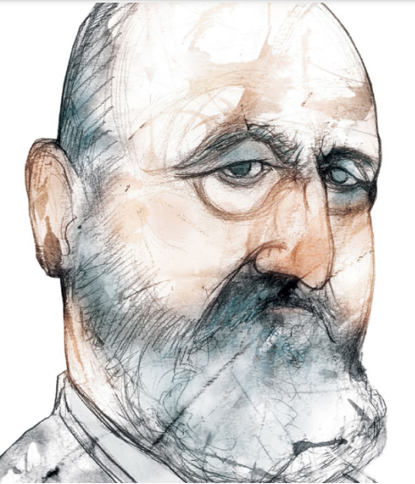

# 1914
## Floating-Point Numbers
#### **Leonardo Torres y Quevedo** (1852–1936), **William Kahan** (b. 1933)
---
Leonardo Torres y Quevedo adalah seorang insinyur dan matematikawan Spanyol yang senang membuat mesin praktis. Pada tahun 1906, ia mendemonstrasikan model perahu yang dikendalikan radio untuk raja Spanyol, dan ia merancang kapal udara semirigid yang digunakan dalam Perang Dunia I.

Torres juga penggemar mesin analisis dan perbedaan Babbage. Pada tahun 1913, ia menerbitkan _Esai_ dalam _Otomatisasi_,yang menggambarkan pekerjaan Babbage dan mempresentasikan desain mesin yang dapat menghitung nilai rumus a(y–z)2 untuk nilai tertentu dari _a, y, dan z_ .Untuk memungkinkan mesinnya menangani rentang angka yang lebih luas, Torres menemukan aritmatika titik-mengambang.

Aritmatika titik-mengambang memperluas jangkauan perhitungan numerik dengan mengurangi akurasinya. Alih-alih menyimpan semua angka dalam sebuah angka, komputer hanya menyimpan beberapa angka penting, yang disebut _signifikan_ ,dan eksponen yang jauh lebih pendek. “Angka” yang sebenarnya kemudian dihitung menggunakan rumus: signifikan dan basis ×eksponen

Misalnya, produk domestik bruto Amerika Serikat pada tahun 2016 adalah 18,57 triliun dolar. Menyimpan nomor itu dengan representasi titik tetap membutuhkan 14 digit. Tetapi menyimpannya dalam floating point hanya membutuhkan 6 digit: $18,57 triliun = 1,857 × 1013

Jadi, dengan bilangan floating-point, kadang-kadang disebut _notasi ilmiah_ pada kalkulator modern, register 10-digit (gadget mekanis atau elektronik yang dapat menyimpan angka) yang biasanya dibatasi untuk menyimpan angka antara 1 dan 9.999.999.999 malah dapat dipartisi menjadi angka penting 8-digit dan eksponen 2-digit, memungkinkannya untuk menyimpan nomor sekecil 0,0000001 × 10–99  dan sebesar 9,999999 × 1099.

Sistem floating-point modern menggunakan biner daripada angka desimal. Di bawah standar yang dikembangkan oleh matematikawan Kanada William Kahan untuk mikroprosesor Intel® 8086 dan diadopsi pada tahun 1985 oleh Institute of

Electrical and Electronics Engineers (IEEE 754), floating point presisi tunggal menggunakan 24 bit untuk signifikan dan 8 bit untuk eksponen.

Untuk karyanya, Kahan memenangkan Association for Computing Machinery's (ACM) AM Turing Award pada tahun 1989.

##### _Potret Leonardo Torres y Quevedo oleh kartunis dan ilustrator Argentina Eulogia Merle (lahir 1976)._

