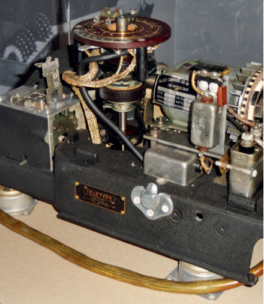

# 1917
## Vernam Cipher
#### **Gilbert Vernam** (1890-1960), **Joseph Mauborgne**(1881–1971)

Kebanyakan algoritma enkripsi adalah _aman secara komputasi_. Ini berarti bahwa meskipun secara teoritis mungkin untuk memecahkan sandi dengan mencoba setiap kunci enkripsi yang mungkin, dalam praktiknya ini tidak mungkin karena mencoba semua kunci akan membutuhkan terlalu banyak daya komputasi.

Lebih dari seabad yang lalu, Gilbert Vernam dan Joseph Mauborgne datang dengan sistem kriptografi yang _secara teoritis aman_: bahkan dengan jumlah daya komputer yang tak terbatas, tidak mungkin untuk memecahkan pesan yang dienkripsi dengan Vernam Cipher, tidak peduli seberapa cepat komputer menjadi.

Vernam’s cipher , hari ini disebut _one-time pad_ ,tidak dapat dipecahkan karena pesan terenkripsi, didekripsi dengan kunci yang salah, dapat menghasilkan pesan yang tampak masuk akal. Memang, hal itu dapat mengakibatkan _setiap_ pesan yang mungkin, karena kuncinya sama panjangnya dengan pesan. Artinya, untuk setiap ciphertext yang diberikan, ada kunci yang membuatnya didekripsi sebagai ayat dari Alkitab, beberapa baris dari Shakespeare, dan teks di halaman ini. Tanpa cara untuk membedakan dekripsi yang benar dari dekripsi yang salah, cipher secara teoritis tidak dapat dipecahkan.

Bekerja di American Telephone and Telegraph Company (sekarang AT&T®) pada tahun 1917, Vernam menciptakan stream cipher yang mengenkripsi pesan satu karakter pada satu waktu dengan menggabungkan setiap karakter pesan dengan karakter kunci. Pada awalnya Vernam mengira kunci itu bisa jadi hanya pesan lain, tetapi tahun berikutnya, bekerja dengan Joseph Mauborgne, seorang kapten di Korps Sinyal Angkatan Darat AS, keduanya menyadari bahwa kunci itu pasti acak dan tidak berulang. Ini meningkatkan keamanan secara substansial: jika kuncinya adalah pesan lain, adalah mungkin untuk membedakan kunci yang mungkin dari yang tidak mungkin. Tetapi jika kuncinya benar-benar acak, maka kunci apa pun sama mungkinnya. Bersama-sama, kedua penemu menciptakan apa yang sekarang kita sebut sebagai pad satu kali, salah satu dari hanya dua sistem enkripsi yang diketahui yang terbukti tidak dapat dipecahkan (yang lainnya adalah kriptografi kuantum).

Ternyata, seorang bankir bernama Frank Miller juga telah menemukan konsep papan satu kali pada tahun 1882, tetapi sistem pena-dan-kertasnya tidak dipublikasikan atau digunakan secara luas.

##### _Perangkat pad sekali pakai yang digunakan dengan sistem sandi SIGTOT yang digunakan di atas pesawat Douglas C-54 milik Presiden Roosevelt_

