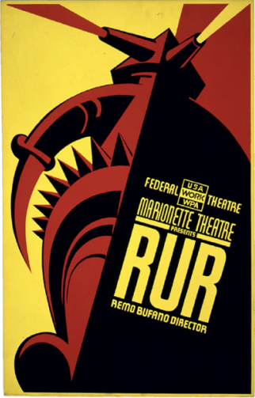

# 1920
## _Rossum’s Universal Robots_
#### **Karel Čapek** (1890–1938)
---
Kata _robot_ diciptakan pada tahun 1920 oleh dramawan Ceko Karel apek dalam hit fiksi ilmiahnya, RUR (Robot Universal Rossum). Dia menciptakan kata berdasarkan kata Ceko robot(“pekerja yang dipaksa"); kata itu sekarang banyak digunakan untuk makhluk mekanis di sebagian besar bahasa. Dalam drama tersebut, perusahaan fiksi Rossum telah mengembangkan mesin humanoid biologis murah yang disebut robot dan telah mengirimkannya ke seluruh dunia dari pabrik rahasianya yang berbasis di pulau. Sementara beberapa negara pada awalnya menggunakan robot sebagai tentara, akhirnya dunia kurang lebih menerima robot dan menggunakannya.

R. U. R termasuk banyak kiasan sastra yang akan menjadi biasa dalam literatur robot masa depan: sebuah organisasi bawah tanah yang berusaha untuk membebaskan robot; robot cerdas yang dirakit dari bagian-bagian, dengan rentang hidup yang pendek, tanpa rasa sakit, dan tanpa emosi; dan seorang ilmuwan yang menyenangkan dengan etika yang dipertanyakan. Mahal pada awalnya,R. U. R.’s harga robot turun dari $10.000 menjadi $150—dari sekitar $130.000 menjadi $2.000 dalam uang hari ini. Di dunia apek, perang adalah kenangan, angka kelahiran manusia menurun, dan masa depan tampaknya dapat diprediksi dan menyenangkan. Babak pertama drama itu sebagian besar dikhususkan untuk menceritakan kisah ciptaan fantastik ini dan mengajukan pertanyaan filosofis: jika manusia tidak perlu bekerja, lalu apa tujuan mereka?

Dan kemudian robot memutuskan untuk membunuh setiap manusia terakhir di planet ini. Meskipun sebagian besar dilupakan sekarang,R. U. R. diterima dengan baik dan populer. Drama tersebut diproduksi di Praha, London, New York, Chicago, dan Los Angeles. Ketika Isaac Asimov menulis Tiga Hukum Robotikanya, dia melakukannya sebagian besar untuk mencegah masa depan yang dibayangkan apek. Meskipun Čapek salah teknologi—ia membayangkan bahwa robot akan bersifat biologis, bukan berdasarkan mekanisme dan komputasi—visinya yang meyakinkan tentang dunia di mana umat manusia secara bersamaan dibantu, diubah, dan akhirnya dibekap oleh ciptaan mekanisnya masih menghantui kita hingga hari ini. 

##### _Sebuah poster untuk presentasi Proyek Teater Federal tentangRURdi Teater Marionette, 1936– 1939._

