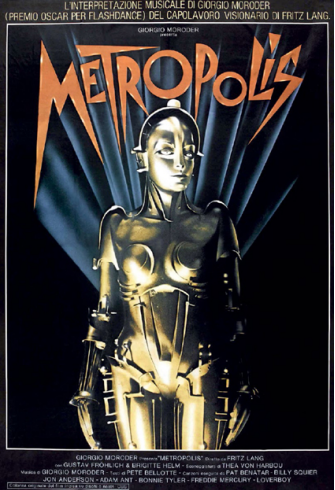

# 1927
## _Metropolis_
#### **Fritz Lang** (1890–1976)

Pada tahun 1927, sutradara film Jerman Fritz Lang sudah memvisualisasikan seperti apa kehidupan di tahun 2026 nanti. Teknologi tampil menonjol di lanskap kota dari film bisu hitam-putihnya Metropolis—yang dianggap oleh banyak orang sebagai salah satu film fiksi ilmiah paling berpengaruh sepanjang masa. Visi dystopian-nya menggambarkan pekerja yang tertindas di bawah tanah bekerja keras pada tugas-tugas berulang yang tidak ada artinya pada mesin yang menjalankan kota. Di atas tanah adalah surga di mana elit kota menjalani kehidupan yang memanjakan. Interpretasi dari dunia yang digerakkan oleh teknologi Lang dapat dilihat di film-film seperti _Blade Runner_.

Plot dari _Metropolis_ melibatkan robot wanita yang dibangun menyerupai istri almarhum pemimpin kota. Kemudian, ilmuwan gila yang menciptakannya mengubah tokoh utama dalam cerita—seorang pengasuh bernama Maria—menjadi robot wanita. Untuk menyelesaikan transformasi ini, ilmuwan menggunakan sejumlah besar energi listrik dan teknologi futuristik.

Sementara robot mewujudkan daya tarik manusia yang berkelanjutan dengan bagaimana kemajuan teknologi dapat berdampak dan berintegrasi ke dalam kehidupan manusia, fakta bahwa robot itu perempuan jarang terjadi. Kebanyakan robot yang ditampilkan dalam fiksi dan budaya pop pada masa itu adalah laki-laki atau tanpa gender. Robot ini—digambarkan sebagai istri pemimpin dan kemudian Maria—digambarkan sebagai sosok yang kuat dan feminin. Dampak budaya dari peran itu sejak itu terlihat dalam banyak karakter dan citra wanita, seperti selingan "Sweet Dreams" Beyoncé selama tur dunia, yang menampilkan video penyanyi dalam kostum robot yang sangat mirip dengan "Maria."

Pada tahun 2006, Carnegie Mellon University (CMU) memasukkan Maria ke dalam Robot Hall of Fame-nya. Di situs Hall of the Fame, CMU mengakui robot Maria sebagai "gambar tunggal paling kuat dari film fiksi ilmiah awal dan inspirasi berkelanjutan dalam penciptaan citra robot wanita baik dalam sains maupun fiksi ilmiah."

##### _Sebuah poster untuk rilisan ulang tahun 1984 dariMetropolis,film tahun 1927 karya sutradara film Jerman Fritz Lang._

#
#
# 1927
## LED pertama
#### **Oleg Vladimirovich Losev** (1903–1942)

Meskipun sifat electroluminescent beberapa kristal ditemukan di Inggris pada tahun 1907, butuh lebih dari satu dekade kerja oleh ilmuwan Rusia otodidak Oleg Vladimirovich Losev untuk mengembangkan teori (berdasarkan teori fotolistrik Einstein) tentang bagaimana efeknya bekerja, dan untuk menghasilkan perangkat yang dapat digunakan dalam aplikasi praktis. Secara total, Losev menerbitkan 16 makalah akademis yang muncul di jurnal ilmiah Rusia, Inggris, dan Jerman antara tahun 1924 dan 1930, yang secara komprehensif menjelaskan perangkat dalam prosesnya. Dia melanjutkan untuk datang dengan aplikasi baru untuk dioda pemancar cahaya (LED dan semikonduktor lainnya, termasuk "perangkat relai cahaya," penerima radio, dan penguat solid-state, sebelum mati kelaparan selama Pengepungan Leningrad pada tahun 1942.

LED ditemukan kembali pada tahun 1962 oleh empat kelompok peneliti Amerika yang berbeda. Kali ini teknologi tidak akan hilang. Dibandingkan dengan tabung pijar, neon, dan nixie hari itu, LED mengkonsumsi daya jauh lebih sedikit dan praktis tidak menghasilkan panas. Mereka hanya memiliki tiga kelemahan: mereka hanya dapat menghasilkan lampu merah, tidak terlalu terang, dan harganya sangat mahal—masing-masing lebih dari $200 pada awalnya.

Pada tahun 1968, peningkatan produksi memungkinkan perusahaan menekan harga LED masing-masing menjadi lima sen. Pada harga itu, LED mulai muncul di kalkulator, jam tangan, peralatan laboratorium, dan, tentu saja, komputer. Memang, LED diatur sebagai lampu individu dan tampilan numerik tujuh segmen adalah salah satu output utama untuk generasi pertama mikrokomputer pada pertengahan 1970-an. Bahkan LED awal dapat dinyalakan dan dimatikan jutaan kali per detik, sehingga penggunaannya dalam komunikasi serat optik. Pada tahun 1980, LED inframerah mulai muncul di remote televisi.

Meskipun LED biru dan ultraviolet ditemukan pada 1970-an, sejumlah terobosan diperlukan untuk membuatnya cukup terang untuk penggunaan praktis. Hari ini tantangan tersebut telah diatasi. Memang, lampu rumah LED putih terang yang sebagian besar telah menggantikan bola lampu pijar dan lampu neon didasarkan pada LED ultraviolet yang merangsang fosfor putih.

##### _Delapan dekade setelah ditemukan pada tahun 1927, dioda pemancar cahaya akhirnya cukup terang dan cukup murah untuk menggantikan bola lampu pijar dalam skala besar._

