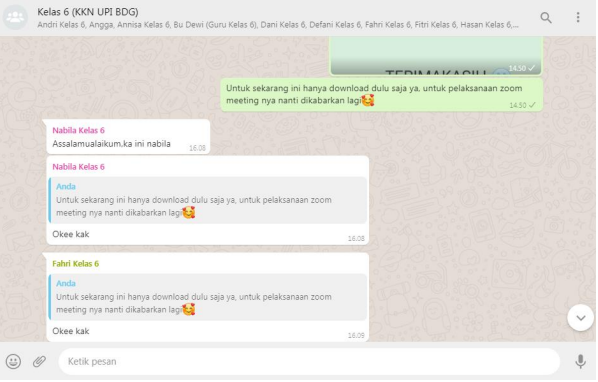
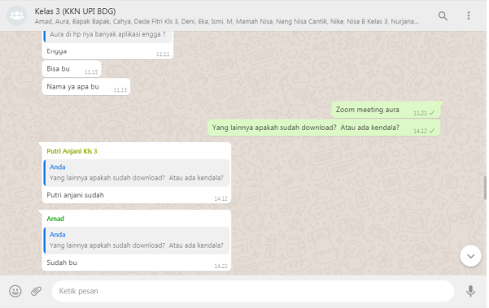
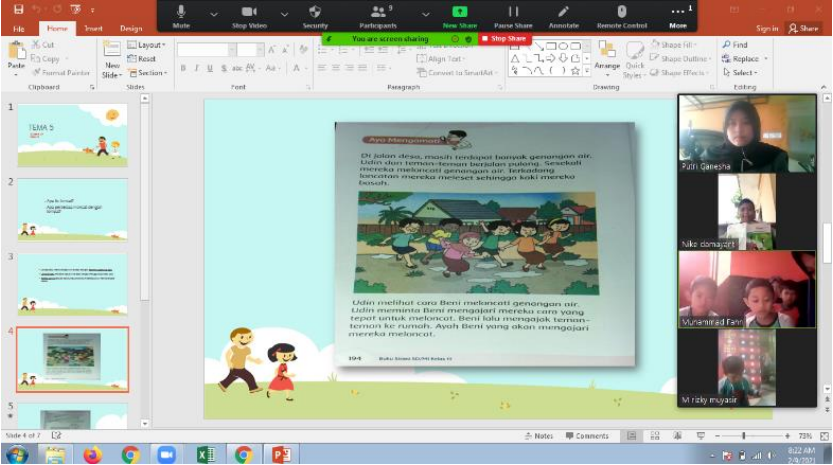
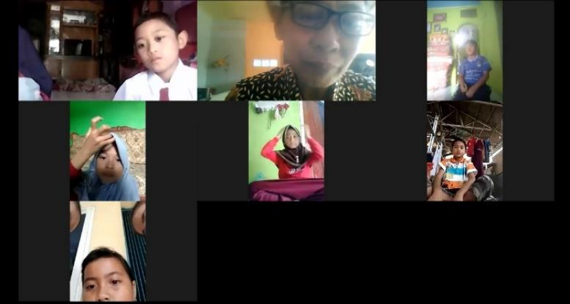
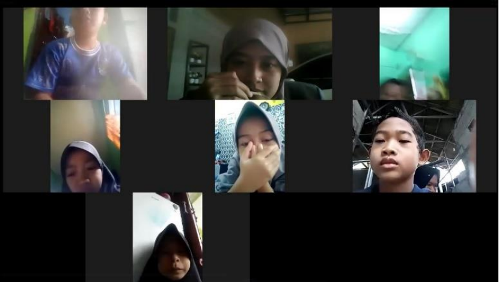

# Aplikasi Pembelajaran Online di Masa Pandemi Covid-19 Melalui Zoom Meeting di SD

Dampak Covid-19 berdampak sangat kuat terhadap pendidikan, oleh karena itu di bidang pendidikan, pemerintah melalui Kementerian Pendidikan dan Kebudayaan telah menerapkan kebijakan belajar dari rumah. Pembelajaran online menggunakan Zoom Meeting merupakan solusi dari pelaksanaan pembelajaran online, namun kita sudah mengetahui bahwa pembelajaran online tidak semudah belajar seperti biasanya atau pembelajaran offline.

Pembelajaran dari Rumah (BDR) dilaksanakan dengan sistem Pembelajaran Jarak Jauh (PJJ). Dalam Undang-Undang Nomor 20 Tahun 2003 pasal 1 ayat 15, menjelaskan bahwa PJJ adalah pendidikan dimana peserta didik dipisahkan dari pendidik dan pembelajarannya menggunakan berbagai sumber belajar melalui teknologi komunikasi, informasi dan media lainnya. Dalam pelaksanaannya, PJJ terbagi menjadi dua pendekatan, yaitu pembelajaran jarak jauh online (online) dan pembelajaran jarak jauh offline. Dalam melaksanakan PJJ, satuan pendidikan dapat memilih pendekatan (online atau offline atau kombinasi keduanya) sesuai dengan karakteristik dan ketersediaan, kesiapan sarana dan prasarana (Irfan & Ariandi, 2021).

Berdasarkan uraian di atas yaitu salah satu jenis PJJ adalah pembelajaran online. Dalam konteks pembelajaran, pembelajaran online merupakan metode pembelajaran yang menggunakan model interaktif berbasis internet dan Learning Management System (LMS), seperti menggunakan Zoom, Google Meet, dan sebagainya. Belajar online tentu memiliki tantangan tersendiri. Berbeda dengan offline, tidak hanya membutuhkan suasana yang mendukung di rumah untuk belajar, tetapi juga koneksi internet yang memadai. Namun, proses belajar yang efektif sama pentingnya (Kolb, 1976).

Penulis menerapkan penelitian ini pada pembelajaran online menggunakan Zoom Meeting. Zoom Meeting adalah aplikasi yang memudahkan orang untuk bertemu tatap muka dan berkomunikasi tanpa harus bertatap muka. Zoom Meeting merupakan aplikasi yang digunakan untuk membantu proses pembelajaran tatap muka menggunakan video. Singkatnya, Zoom Meeting adalah aplikasi berbasis video. (Handayani, 2020).

Metode penelitiannya adalah kualitatif dengan manusia sebagai objeknya. Pendekatan yang digunakan adalah fenomenologi. Penelitian ini dilakukan di sekolah SD Karya Mekar dengan sasaran utama siswa kelas 3 dan 6.
#
Pada tahap pertama penulis melakukan observasi kepada kepala sekolah dan guru di sekolah mengenai media pembelajaran apa saja yang digunakan dalam pembelajaran online selama pembelajaran berlangsung saat pandemi ini. Media pembelajaran yang digunakan hanya melalui **WhatsApp**, seperti pada Gambar 1 dan 2. Dengan hanya menggunakan whatsapp siswa masih mengalami kesulitan dengan **kendala ekonomi**, adapun siswa yang tidak memiliki handphone atau orang tuanya tidak memiliki handphone, oleh karena itu beberapa siswa yang tidak memiliki handphone harus menyerahkan tugasnya langsung ke sekolah dengan tetap berpegang pada protokol kesehatan (Anshari dkk., 2016). Dalam pembelajaran siswa dibagi menjadi beberapa kelompok, sehingga pada saat mengumpulkan tugas secara langsung hanya ketua kelompok yang pergi ke sekolah.

  

###### 
 **Gambar 1.** Bukti Pendidikan 

#

###### 
 **Gambar 2.** Bukti Pendidikan 

#

Kendala media pembelajaran tidak hanya dialami oleh siswa, tetapi juga oleh guru (Al Farizi, 2019). Guru dikatakan 'clueless' dengan teknologi gagap, sangat disayangkan jika di masa pandemi seperti ini tidak menggali teknologi informasi lebih luas harus dimanfaatkan dengan sebaik-baiknya. Dalam hal ini, guru hanya dapat menggunakan media sosial WhatsApp untuk pengumpulan tugas saja. Mereka tidak memahami media pembelajaran online. Karena tidak semua siswa memiliki kondisi ekonomi yang sama, guru tidak mencari teknologi informasi. Tahap selanjutnya penulis melakukan edukasi pembelajaran online melalui media sosial WhatsApp yaitu **Zoom Meeting** kepada siswa, guru dan orang tua siswa. Edukasi adanya media pembelajaran online Zoom Meeting dengan menjelaskan cara penggunaan Zoom Meeting dan lain-lain.
#

Terlihat pada Gambar 1 dan 2 respon siswa sangat antusias dan rasa penasaran mereka muncul dan ingin segera melaksanakan Zoom Meeting. Namun kendala saat akan mendownload kebanyakan mobile siswa tidak mencukupi untuk melakukan download, namun hal tersebut dapat diatasi dengan menghapus aplikasi yang kurang bermanfaat. Adapun mengapa penulis memilih menggunakan Zoom Meeting, agar siswa dapat bertatap muka walaupun hanya secara online. Tidak hanya itu, agar siswa mengetahui media pembelajaran melalui Zoom Meeting, karena Zoom Meeting banyak digunakan oleh institusi pendidikan (Serhan, 2020).

Pada Gambar 3, pendampingan siswa mata pelajaran PJOK melalui Zoom Meeting. Di Gambar 3, pertemuan pertama siswa sedikit bingung, mulai dari join, nyalakan audio speaker, mute, unmute dan nyalakan kamera.

  

###### 
 **Gambar 3.** Bukti Pertemuan Zoom 1 

#

Pada Gambar 4 yaitu pertemuan kedua melaksanakan mentoring siswa pada mata pelajaran tematik, sehari sebelum pelaksanaan siswa sudah bertanya-tanya kapan akan melaksanakan Zoom Meeting, siswa sangat antusias. Pada pertemuan kedua, siswa tidak kesulitan lagi dalam menggunakan Zoom Meeting (Serhan, 2020). 

  

###### 
 **Gambar 4.** Bukti Pertemuan Zoom 2 

#

Pada Gambar 5, pertemuan ketiga adalah pelaksanaan pendampingan siswa pada mata pelajaran tematik. Pada pertemuan ketiga ini siswa menjadi lebih percaya diri dalam menggunakan Zoom Meeting. Dan tidak hanya pendampingan, penulis melakukan wawancara langsung melalui Zoom Meeting tentang bagaimana dengan Zoom Meeting, apakah sulit atau menyenangkan? Jawaban siswa hanya masalah ponsel dan kuota internet yang tidak mencukupi. Apa yang dikatakan di awal sebenarnya kendalanya hanya pada media elektronik dan kuota karena tidak semuanya memiliki ekonomi yang sama. Untuk pelaksanaannya, para siswa sangat antusias.

  

###### 
 **Gambar 5.** Bukti Pertemuan Zoom 3 

#

## KESIMPULAN

Penerapan pembelajaran online melalui Zoom Meeting di SD Karya Mekar berhasil dilaksanakan, dengan siswa yang sangat antusias melakukan pembelajaran online melalui Zoom Meeting. Namun kendala yang dihadapi adalah media elektronik dan kuota internet untuk pembelajaran online. Tidak semua siswa sama dalam hal ekonomi, itu saja masalahnya. Untuk pelaksanaannya tidak ada kendala dan sangat diinginkan oleh siswa SD Karya Mekar khususnya kelas III.
Maka dengan adanya zoom meeting setidaknya siswa-siswi dapat bertatap muka selama pembelajaran meskipun tidak secara langsung.